# Intro to Operating Systems

What is an operating system – no universal definition, but generally software acting as intermediary between user and hardware.

The main OS responsibility ius to allocate resources to use processes and control their execution. E.g. control access to memory when it is used by multiple processes.

Services of an operating system can be split to 2 categories: useful to user (run programs, io operations, file system management) and useful to the system (resource allocation, security)  

**Program execution stages:** load program into memory, execute program, stop program.

**I/O operations:** write something to file, take input from keyboard/mouse/peripherals. User processes don’t control devices directly - instead, the OS controls them and allows multiple processes to access the same IO devices.  

**File system management:** allows programs to read/write files and other complex actions, subject to permission management.  

**Communications between processes:** OS allows such communications between processes on the same computer or through a network. The main ways to do this are sharing memory or direct messages.

**Error handling:** caused by hardware failure, IO devices or bad software. The OS handles the error to prevent a full system crash and generally stops the process that created the error. Sometimes the OS cannot prevent a full system crash if the error occurs in a critical process.

**Resource allocation:** scheduling CPU time and other hardware resources to different processes to allow multiple processes to run concurrently. Considers type of process, speed of hardware, number of jobs to be executed etc.

**Accounting:** keeps track of which processes are running and the amount of resources used, useful for system admin for billing purposes or to find misbehaving processes.

**Security:** concurrent processes cannot interfere with each other or the OS itself (purposefully or otherwise), and must keep the system secure - process's shouldn't be able to access other process's memory space unless authorised.

**Kernel**: the core of an OS, loaded into memory at startup and always running – provides necessary services like memory management, process scheduling, file handling.  

**Kernel space**: part of memory which stores kernel, kept separate from user space where user processes are. The split is to prevent user processes from interfering with the kernel for both security and stability. User processes can access kernel space through system calls that require permissions, giving limited access if required and the user process is trusted.

**System calls:** an interface where the user processes can request services (privileged operations/instructions) from the kernel. System calls provide access the low-level functions done only by the OS, e.g. hardware resource management, file operations, IO device access, etc, and can be limited to only authorised processes to increase security.

**Dual mode operation:** the hardware operates in kernel mode or user mode depending on if the operations are requested by the OS or user processes. Privileged instructions are only executable in kernel mode as they could be abused by malicious user processes. System calls change the mode to 0/kernel, and the return from a call changes it to 1/user.

# OS structure

OS structure is large and complex.

**Early OS:** simple structures with not well defined levels, e.g. several layers could access IO devices. Hardware didn’t support dual mode operation.

**Early UNIX:** huge amount of functionality built into the single kernel layer. Very little overhead in system calls, but hard to maintain and modify due to interdependencies. These monolithic structures have elements that have carried over into modern OS.

**Layered approach:** each layer interacts with the layers above and below, capped by the hardware and user processes. Layer K uses the services of layer K-1 and provides services to layer K+1. Modular design allows for easy layer modification, as the services they require and need to provide are already specified, so can easily modify the implementation without changing functionality. However, layer definition can be difficult – it must be ensured that layer K+1 doesn’t require services from layers below K-1. Also, more kernel layers mean more system calls between layers, increasing the overhead of services provided to the user.  

**Microkernels:** modular design of kernel, remove all non-essential services from kernel and implement them as user services, e.g.

**Advantages**:

- Easy to extend the kernel due to simplicity
- Security and reliability are better as there is less to go wrong in the kernel  

**Disadvantages:**

- Performance suffers as there is more user-kernel processes interaction, so more system call overhead

**Loadable kernel:** the most modern approach and used in Windows/Linux/MacOS. A micro-like kernel implements the core services while other complex kernel services are loaded and run as is required. Similar to layered as each module is specifically designed for one purpose, but any module can interact with any other, so easier to access other kernel services.

# Processes

**What is a process:** a program currently in execution (in memory). One application can create several processes.

**Process in memory:**

- Text – stores instructions
- Data – stores the global and static variables
- Heap – dynamically allocated memory
- Stack – stores local variables and function parameters e.g. return address of the function

**Process states:**

- New – process is being created
- Running – instructions from the process are being executed
- Waiting – the process is waiting for some event to occur
- Ready – the process is waiting to be assigned to a processor
- Terminated – process has finished execution

State change graph:

**Process Control Block (PCB):**

- OS maintains a PCB for each process – data structure tracking the process
- Keeps track of:
  - Process state – running, waiting, ready, etc
  - Program counter – location of next instruction in process
  - CPU registers – contents of the CPU registers for use in case of interruptions
  - CPU scheduling information – priorities, scheduling queue pointers
  - Memory management info – locating process in the memory
  - Accounting info – CPU time used, time since start
  - IO status – list of files/IO devices in use by process

### Switching between processes

**Process Scheduling:**

- To maximise CPU use, processes are switched from on/off as others wait
- Process scheduler selects among available processes for next execution on CPU
  - Job queue – set of all process in the new state (long term scheduler)
  - Ready queue – set of all processes in the ready state (short term scheduler)
  - Device queue – set of processes waiting for an IO device

**Queues:** contains a head and a tail pointing to the next process to be serviced and the last one to be, with each process also pointing to the next in the queue. Processes can be inserted in any point in the queue depending on the priority by starting at the head and inserting when the new process has greater priority than the next in the queue.

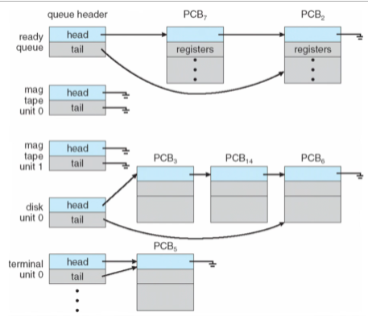

### Queuing diagram

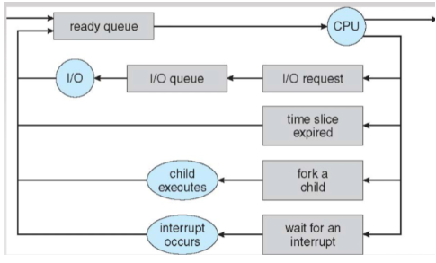

## **Schedulers**

There are 2 main types of schedulers: short term and long term.

**Short term scheduler:**

- Selects the next process to be executed from the ready queue
  - Not necessarily FIFO - can be priority queue or linked list based on scheduling algorithm
- Invoked very frequently – at least once every 100ms
- Must be very fast – if it takes 10ms to decide a CPU burst on a process of 100ms, then 9% of CPU time is wasted

**Long term scheduler:**

- selects processes in the new state to be brought into memory and ready queue
- Infrequent – can take minutes between creating one process and the next
- Controls number of processes in memory – when stable the arrival rate = completion rate
- Processes can be IO bound (more time doing IO than computation – short CPU burst) or CPU bound (more time doing computation – long CPU burst) - the long term scheduler tries to get a good mix of these processes

Time-sharing systems like Linux/Windows don’t have a long term scheduler and dump all processes on the short term scheduler. Long term schedulers are only used in computational workstations or similar where maximising CPU usage is needed and fast response to user input isn't required.

**CPU Scheduling Goals:**

- **Maximise CPU utilisation** - proportion of time the CPU is busy (not idle)
- **Maximise Throughput** - Number of process that complete their execution per time unit
- **Minimise turnaround time** - Amount of time to execute a particular process
- **Minimise waiting time** - Amount of time a process waits in the ready queue
- **Minimise response time** - Amount of time taken from request submitted to first response (very important)

### **When does a scheduler schedule?**

**Non-preemptive scheduling:** A process voluntarily stops and gives scheduler the CPU.

**Preemptive scheduling:** A process is forced to stop and give the scheduler the CPU. In this case, a process may have been added to the ready queue and could have higher priority than currently running process so this must be checked. This can cause race conditions if a process is '*preempted*' (forced to stop) while updating shared data (outside a critical region) that is accessed by another scheduled process. 

- A process switches from running to waiting (non-preemptive)
- A process switches from running to ready (preemptive)
- A process switches from waiting to ready (preemptive)
- A process terminates (non-preemptive)

### **Scheduling algorithms**

**First come first serve (FCFS):**

- Tasks assigned to the CPU in order of arrival.
- Can lead to un-optimal average waiting time, varies greatly depending on arrival sequence.
- Never does preemptive scheduling.

**Shortest job first (SJF):**

- Process assigned in order of increasing CPU burst time.
- Always gives the smallest average waiting time, but may cause a long CPU burst time process a large wait time.
- CPU burst time for a process cannot be known: the scheduler estimates the length of time of each process.
  - This can be done using 'Exponential Moving Average'
  - 
- Can be preemptive or not: if preemptive, then CPU is stolen and runs the scheduler each time a new process joins the ready queue (preemptive gives better results assuming 0 overhead).

**Priority scheduling:**

- Each process is given a priority and assigned in order of priority.
- Can be preemptive or not, like SJF.
- Starvation is an issue - very low priority processes may never get scheduled if there is a large amount of incoming processes.
  - '*Aging*' solves this my gradually increasing the priority of processes that haven't been scheduled.

**Round robin (RR):**

- CPU runs in small bursts of time quantum '*q*'. After this time, the process is preempted and added to the end of the ready queue.
- Generally new processes are added to the end of the queue - assigned in order of arrival.
- For N processes and time quantum *q*, each process gets 1/N of the CPU time in chunks of at most *q* time units at once. No process waits more than (N-1)\**q* after being added to the ready queue.
- If *q* is too large, then this becomes FCFS and if *q* is too small, then there are many context switches and high overhead.
- *q* is typically 10-100ms (where a context switch takes < 10us).

## **Process creation**

All processes are created by other processes, except the kernel process which begins at startup (named 'init'). The *'child processes'* can create more processes – this forms a process tree, the root of which is the kernel.

Processes are identified using a process identifier - the *'PID'* (an integer in Linux systems).

**Resource (CPU, memory, file) sharing:**

- There are 3 options for resource sharing between parent and child processes
  - The parent and child can share all resources
  - The child can share a subset of the parents resources, e.g. CPU and not memory/file
  - The parent and child share no resources

**Execution options:**

- There are 2 options for how parents and child processes execute
  - Parent and child execute concurrently
  - Parents waits until children terminate

**Address space:**

- 2 options:
  - Child’s address space and program is duplicate of parents (text, data, heap and stack are copied, not shared)
  - Child loads a new program into address space (no similarities)

**fork():** C command to create child processes that is an exact copy of the parent (including data/heap/stack) and continues from the line after fork(). In the child process, fork() returns 0 and in the parent process fork() returns the PID of the child (always an integer above 0).

## **Process Termination**

Processes terminate automatically after their last instruction is complete. Processes can also be terminated using exit() (in C, or using return() in the main function), which returns a status value to parent – parent can catch this to determine the success of the child process. All resources held by a process are released after termination.

Between child process termination and parents receiving the exit code, the child is a *'zombie process'* - the resources have been released but the entry is still in the process table. Once the parent receives the exit status of the child, the entry is removed from the table and the child is fully terminated.

Parent processes can terminate the execution of child process using abort() (in C) call. This is used when child takes up too much resources, no longer required or similar.

### **What happens when a parent exits before their children exit?**

Children become *'orphan processes'*. In UNIX systems, the init process is assigned as the parent process. The init process periodically issues wait() (in C) to collect the exit status of zombie orphan children to release their PIDs and entries in process table. Some OS don't support orphan processes (or child process must be specified to continue even if the parent exits), in which case orphan processes are immediately executed and removed from the process table.

*'Cascading termination'* is when a parent process exits, causing their children to exit, causing their children's children to exit, etc.

## **Inter-process Communication**

Processes running concurrently may want to communicate with each other for various reasons.

- Sharing files
- Sharing data about the user activity in the process
- Etc

There are two methods:

### **Shared memory**

A region of memory shared by communicating processes is created. This shared memory is typically inside one of the processes' memory and other processes requests access to it. System calls are used to create the shared memory, but there is no further use of kernel - there is low overhead. However, significant effort by programmer is required to maintain synchronization – ensure processes don’t try to access the same address at the same time.

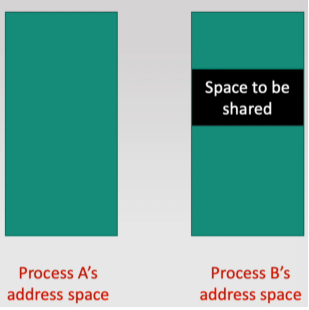

This doesn't work with memory paging, as page tables are generated based on the memory allocated to a process and cannot change.

### **Message passing**

Messages are directly exchanged between the processes using a communication channel provided by the kernel, e.g. a buffer. Processes use system calls to read/write to the buffer. This simplifies job of programmer (as the OS programmer already wrote the hard bit) but has a larger overhead due to many system calls.

The required system calls are a minimum of send() and receive() to allow message passing, whose functions are pretty obvious.

Message passing has multiple implementations/options – direct/indirect, how send/receive is synchronised, buffer size, etc.

- Direct:
  - Processes name each other explicitly when sending messages by using PID or similar
  - Links are established automatically and is associated with only one pair of communicating processes
- Indirect:
  - Messages sent through ‘mailbox’ using mailbox ID
  - Processes can only communicate if they share a mailbox
  - A link is established if processes share a common mailbox
  - Links may be between many processes and pairs of processes may have several communication links

Synchronisation of system messages

- Non-blocking - messages are sent and read whenever
- Blocking – synchronous messaging where messages are only sent when they are expected and only attempted to be received when messages are known to be sent
- Blocking send – sender pauses processing until the message is confirmed to have been received
- Blocked receive – receiver pauses processing until a message is available to receive

Buffering – A communication link is the buffer where messages are stored after being sent and before being read.

- Zero capacity – the queue has length 0, so sender waits until recipient receives the message
- Bounded capacity – the queue has finite length and once the end is reached, the sender must wait until the recipient reads a message from the buffer. This can take the form of a circular queue.
- Unbounded capacity – sender never waits after sending message

**Producer-consumer paradigm:** Shared buffer/memory is filled by a producer and emptied by a consumer - one process only sends messages and the other process only receives them. Consumer operates on the data passed to it by the producer, so waits if there are no messages. Similarly, if the buffer space is bounded then the producer must wait until a message is removed before adding.

## **Ordinary pipes**

Pipes provide a simple mechanism for one-way communication through message passing. The producer sends their output to the input of the pipe, which outputs to the input of the consumer. The consumer is typically a child process of the producer.

In C, the pipe() command creates a pipe by creating 2 temporary files and linking them:

")

X is set to 10 above

**Named pipes:** Exist outside of process run-time, in a directory as a file. These do not require a parent-child relationship that is typically needed in ordinary pipes, and once established many processes can use it for communication.

# Threads

A '*thread*' is a unit of CPU execution: it counts the number of chains of execution in a process. e.g. a single-threaded process has one chain of execution running each line sequentially.

Each thread shares the same code & heap and have individual stacks, thread IDs & register sets.
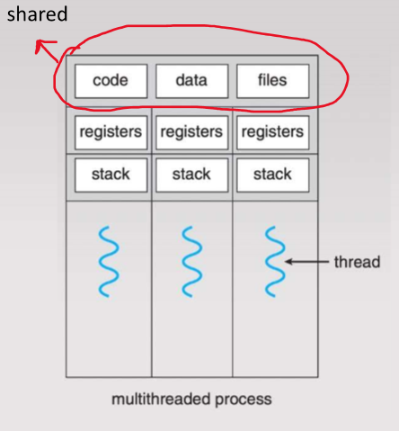

Threads are an alternative to having multiple processes when multiprocessing is required that needs to occur on the same code/data e.g. separate threads for reading in data and processing the data. Thread creation is much more efficient (less overhead) than process creation due to more shared resources, being 30x faster in Solaris OS, as well as thread switching being faster than process switching (context switching).

Web-servers are an example of a good use of multithreading, where many clients will attempt to concurrently access the server. Each client could be handled by their own thread, allowing actual concurrent access through parallel execution. Threads are used and not processes, as the procedure of handling a client request is the same, so the code can be shared.

### **Thread advantages:**

- **Economy** - faster and more efficient that process creation and switching
- **Scalability** - allows for large number of concurrent tasks
- **Responsiveness** - allows continued execution of other threads if there is a section waiting on IO/data input/etc
- **Resource Sharing** - threads share heap, so easy communication between threads

### **Concurrency VS Parallelism**

**Concurrency:** More than one task making progress - a single CPU can achieve this by interleaving process execution so they appear to be running at the same time.

**Parallelism:** Performing more than once task simultaneously (implies concurrency) - requires a multicore CPU.

**Data Parallelism** - distributes subsets of a data set across multiple cores, performing the same type of operation on each subset/core. e.g. summing contents of an array.

**Task parallelism:** - performing different tasks on the same data set simultaneously. e.g. finding the sum and mean of an array.

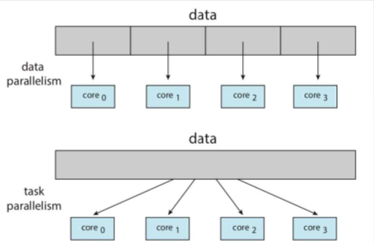

### **Amdahl's Law**

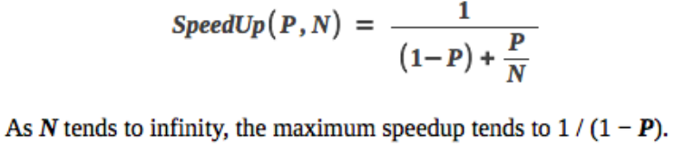
Where P = proportion of process that can be parallelised using N cores and there is no overhead from adding parallelism.

## **Thread (and process) Synchronisation**

Threads and processes will be referred to as just threads from now on as it is essentially the same.

Threads must be synchronised in accesses to shared variables/memory/files. This is to ensure that changes made by threads are not overwritten by other threads with older versions of the data.

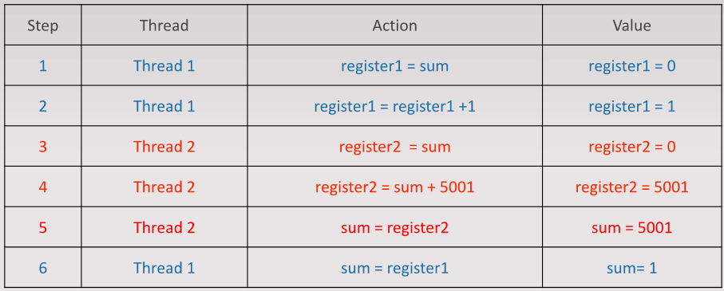

This is a '*race condition*', where the last thread to finish writes their value to the shared variable and only that write matters. Proper thread synchronisation eliminates all race conditions.

A section of code where a thread updates shared variables is called a '*critical section*'. When one thread is in a critical section pertaining to a shared variable, no other thread should be in a critical section that uses that same shared variable - this is '*mutual exclusion*'.

### **The Critical Section Problem**

**Critical Section Problem:** design a protocol such that no two threads can concurrently execute critical sections affecting the same shared variables.

**Ideal Solution Criteria:**

- **Mutual Exclusion** - if thread Pi is executing its critical section, no others can be in theirs.
- **Progress** - if no thread is in a critical section and 1 or more threads are waiting to enter theirs, then one of the waiting threads must be able to enter the critical section.
- **Bounded Waiting** - No thread should wait indefinitely to enter the critical section while other threads are able to enter and exit their critical sections continually (unless there are other threads that do the same job as the waiting thread, e.g. in a thread pool handling web server requests).

**Peterson's Algorithm:**

- Each thread sets a flag indicating they wish to enter the critical section.
- Each thread then sets a shared turn variable to indicate it is another thread's turn in the critical section and not their own.
- Waits (repeats a while loop) until no other thread wants to enter the critical section or turn is set to that thread.
- 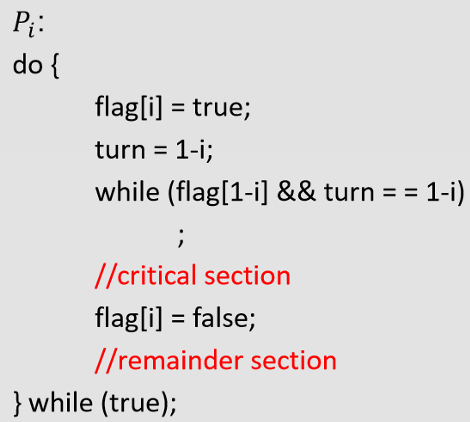
- Uses busy-wait polling - inefficient use of CPU time.
- May fail in modern architectures.
  - New CPUs have out-of-order execution and may execute write operations in a different order to how they were written if no direct conflicts between them to increase efficiency.
  - 

### **Sychronisation Primitives**

Custom hardware based solutions are generally inaccessible to programers, so OS designers build software tools to solve the critical section problem.

### Mutex locks

Mutex locks synchronise threads by forcing them to acquire a lock before performing operations on shared variables. A mutex lock can only be acquired by one thread at a time, and so other threads wait at the point of acquiring the lock and continue once they have it.

All locking/unlocking is performed '*atomically*' - as a uninterruptible instruction (CPU can't switch threads during it). This is usually done using special atomic hardware instructions.

**test_and_set atomic instructions:**

- Returns the original value of the passed parameter **target** and sets the new value of **target** to true.
- Implemented as an atomic hardware operations (can be multiple hardware instructions that cannot be interrupted).
- Does not satisfy ideal solution criteria on its own, as it is possible for a single thread to repeated release and acquire the same lock depending on order of thread execution.
  - 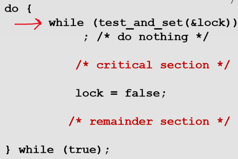
- Satisfies all criteria when implemented with the shared **waiting** array to identify the next waiting process and ensure that no process repeatedly takes the lock.
  - 

### **Semaphores**

Semaphores have integer values: a 0 value indicates that the semaphore is not available (thread can't enter critical section) and a positive value indicates that it is available. Threads that 'acquire' the semaphore decrease its value by 1 and threads that release the semaphore increase its value by 1. This allows for multiple (but a specified amount) threads to enter critical sections at once.

- '*wait(semaphore)*' is the atomic operation used to acquire the semaphore by checking if the semaphore is 0, waiting until it becomes positive then decrementing it by 1.
- '*signal(semaphore)*' is an atomic operation and releases the semaphore by incrementing it by 1.

### **Conditions**

Condition variables are shared variable where a thread can wait until another thread signals that variable to indicate the thread should continue.

- '*wait(cond)*' - the thread waits until woken by the condition being signalled.
- '*signal(cond)*' - a single thread waiting on 'cond' is woken and continues.
- '*broadcast(cond)*' - all threads waiting on 'cond' are woken and continue.

### **Synchronisation issues**

**Deadlock:**

- Multiple threads waiting indefinitely for other waiting threads to take an action.
  - e.g. A is waiting for B to do something and B is waiting for A to do something - neither make any progress and are in deadlock.
  - S and Q are semaphores initialised to 1.
    - 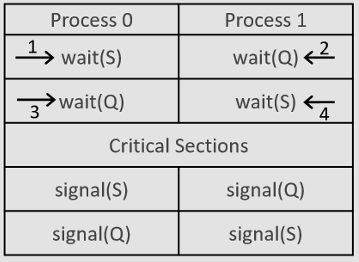
    - No deadlock can occur if Process 1 has same order of acquiring semaphores as Process 0.

**Modelling deadlocks:**

A system contains:

- Different resources R1, R2, …, Rm
  - Mutex locks, CPUs, I/O devices, etc
- Each resource Ri has Wi instances
  - 3 mutex locks, 8 CPUs, etc
- A set of processes {P0, P1, …, Pn}
- Each process utilises a resource by
  - Request
  - Use
  - Release

Necessary conditions for a deadlock:

- Mutual exclusion - only 1 process can use a resource at a time
- Hold and wait - there must be a process holding some resources while waiting to acquire additional resources held by other processes
- No pre-emption - a resource can only be released voluntarily by the process holding it once the task using it is complete
- Circular wait - there exists {Pa, Pb, …, Pd} ⊆ {P0, P1, …, Pn} such that Pa waits for Pb, Pb waits for Pc, …, Pd waits for Pa.

Resource allocation graph (used to identify if deadlocks will occur):

- G = (V,E)
- V is partitioned in 2 parts, P and R
  - P = set of processes
  - R = set of resources
- Request edge - directed edge from Pi to Rj
- Assignment edge - directed edge from Rj to Pi
- Different symbols for processes and resources
  - Process (Pn) is a circle
  - Resource (Rn) is a square with n dots inside, where n is the amount of that resource
-  No deadlock in this resource graph.
-  Deadlock in this resource graph - there is a cycle inside of waiting processes and further investigation shows a deadlock exists.
- No cycle = no deadlock
- Cycle = need to look further - not necessarily a deadlock
  - Can manually find for small examples
  - Need an algorithm for larger graphs

Deadlock detection algorithm:

- Create a table representing the graph
  - 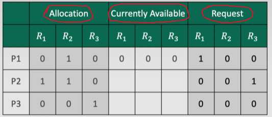
- This table represents the below graph
  - 
- Flags indicating the current state of processes are also required - finished or incomplete
- Once a process is complete, the flag is set to true, indicating that it is complete and it's resources can be released
- A process has its flag set true when the request section of the table contains only 0s
- If no process can be set as complete by allocating available resources, then there is a deadlock (there is no deadlock in the example)

Handling deadlocks:

- Preventing deadlocks
  - A deadlock has necessary conditions - ensure that at least one of these does not happen to prevent a deadlock
    - Mutual exclusion - cannot be prevented for non-sharable resources, e.g. printer, files, etc
    - Hold and Wait - guarantee that when a process requests a resource it is not currently holding any other resources
      - Can be done by having a process request and receive all resources at once
    - No preemption - if a process holding some resources requests additional resources that are not immediately given, release all resources currently held by that process and allocate them back at the same time as the additional resources
    - Circular wait - number resources and require each process to request resources in increasing order
      - A process holding Rn cannot request Ri where i < n.
  - Deadlock prevention creates restrictive system where harmless requests are blocked
    - Consider P1 and P2 both require R1 and R2. R2 is already held by P1, and then P1 requests R1. As R1 < R2, the request is blocked. It is safe to grant the request however as there is no cycle in the resulting system, even if P2 then requests both resources held by P1.
- Avoiding deadlocks
  - Less restrictive than deadlock prevention
  - Determines if a request should be granted based on if resulting allocation is a safe state
  - Safe state is where there is no set of future requests where a deadlock is unavoidable no matter how resources are allocated in response
  - The avoidance algorithm needs information on specific requirements of each process
    - Stated by each process - max number of instances of each resource type is needs
    - When a resource request is received, the deadlock avoidance algorithm checks if granting resource leaves system in a safe state
    - If safe then the resource is granted, else wait until state changes to where granting resource is safe
  - Determining if a state is safe
    - Banker's safety algorithm
      - Consider 5 processes P0 - P4 with 3 resource types: 10 A, 5 B, 7 C
        - Current table
        - 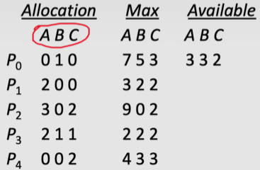
        -  Need = max - allocation: the amount of a resource the process may request in the future given its current allocation.
        - The banker's safety algorithm proceeds in steps, and in each step a process is found which can proceed with the currently available resource
        - Once the process has completed, the resources it was holding can then be reclaimed
        - e.g., P1 can be completed with the available resources and so is processed, giving the next table
        - 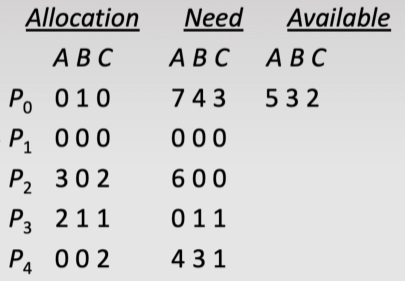
        - Steps are repeated and if at the end all processes are complete, the initial state is safe
    - Resource request algorithm
      - When a request is received, use the bankers safety state algorithm starting with the state after granting the request to determine if it is safe to do so
      - If so, grant request immediately
      - Else keep request pending until next state change and check again

**Starvation:**

- A thread waits indefinitely while other threads make progress (opposite of bounded waiting).
- Can be avoided by randomly choosing threads to wake if multiple are waiting, or by waking the longest waiting thread.

**Priority Inversion:**

- Scheduling issue when a low priority thread holds a lock required by a high priority thread. A medium priority thread takes CPU time from the low priority thread while it is in the critical section and so the high priority thread is delayed.
  - 
  - Can be fixed by '*priority-inheritance*' - the priority of the thread taking the lock is upgraded to the highest priority of the threads waiting for the lock.

## **Classic Synchronisation Problems**

These are used to test new synchronisation schemes to ensure that they fully solve the issues.

**Bounded Buffer problem:**

- *n* buffers, each can hold one item.
- Producers create items and add them to buffers and Consumers remove items from buffers to process them.
- Producers should never be able to write to the same buffer or write to a full buffer.
- Consumers should not be able to take the same item from a buffer or try to read from an empty buffer.

**Readers and Writers problem:**

- A data set is shared among concurrent processes
  - Readers do not update the data set, only look at the data inside
  - Writers both read and write to the data set
- Multiple readers should be able to access the data set at any time as they do not modify it
- Only a single writer should be able to access the data set at any one time
- Readers have preference over writers if both waiting - writers may starve even in ideal solutions.

**Dining Philosophers problem:**

- Circular table of philosophers, each with a chopstick to their right in between them and the next person.
- Each person needs both chopsticks to be able to eat and releases them when done. Can only take the chopsticks next to them.
- In 5 person case:
  - 
  - Semaphore chopstick[5] all initialised to 1.
  - Failed solution: if all people start at the same time and pick up a chopstick each, then deadlock occurs.
    - 
  - Solutions:
    - Restrict number of people sitting down to 1 less than the number of seats - inefficient but would work.
    - Only allow a philosopher to pick up the chopsticks if both are available - picking is done withing a critical section.
    - Alternating order of picking up chopsticks - every other person picks up the chopsticks left then right, while the others pick up chopsticks right then left.

## **Thread types and Threading models**

There are two different thread types: user threads and kernel threads.

### User-level threads

- Implemented by user programs in the user space
- Kernel is not aware of their existence and does not manage them, no kernel access overhead
- Cannot run in parallel on different CPU cores, but can run concurrently

### Kernel-level threads

- Implemented by the kernel in the kernel space
- Kernel can schedule them on different CPU cores - true parallelism
- Managed by kernel, so increased kernel overhead

### **Threading Models**

**Many-to-one:** Many user-level threads are mapped to a single kernel thread.

- Advantages
  - Only a single kernel thread, little overhead
- Disadvantages
  - Cannot run in parallel due to only a single kernel thread
  - A blocking thread causes all threads to stop until unblocked

**One-to-one:** Each user-level thread has its own kernel thread. (Used )

- Advantages
  - Other threads can run while one is blocking
  - Threads can run on different cores in parallel
- Disadvantages
  - If many kernel threads are created then the overhead becomes large and can slow the system

**Many-to-many:** Many-to-one, but there are multiple kernel threads with unique processes mapped to them.

- Advantages
  - The number of kernel threads and amount of user threads mapped to each can be varied in order to increase performance and reduce overhead (still more than many-to-one)
  - Kernel threads can run in parallel
- Disadvantages
  - User threads can still be blocked if running on the same kernel thread
  - Complex to implement

## **Server threading models**

- One thread per request
  - Each new request creates a new thread to handle it
  - High overhead as threads are repeatedly created and destroyed
  - High traffic will create large numbers of threads, slowing down the system
  - Can potentially handle any amount of clients concurrently - no queues
- Thread pool
  - Fixed number of 'worker' threads that handle requests from a queue
    - More efficient than creating and destroying threads
    - Number of threads can be optimised for a specific system to ensure no system slow down from too many threads
  - Requests are added to the queue by the main server thread
  - Synchronisation is required to ensure that no threads attempt to handle the same request and that a request isn't left unhandled

## **Signal Handling**

Used to notify a process about occurrence of events. A signal is generated by a particular event, the signal is delivered to the process it applies to and then the process handles the signal.

**Synchronous:** Internally generated by the process, e.g. runtime logic errors like division by 0 or illegal memory access.

**Asynchronous:** Externally generated, e.g. terminating the process from the command line.

Every signal has a default handler in the process provided by the kernel, e.g. the default handler for SIGINT terminates the process. '*user-defined*' signal handlers can be created by the process that overrides the default handler. Any signal handlers defined by the process can only use '*signal safe*' commands.

In multi-threaded programs, signals can be delivered to all or specific threads. *Synchronous* signals are generally sent to only the thread generating the signal, while *Asynchronous* signals are usually sent to all threads, e.g. SIGINT.

# Memory

**Memory:** an array of bytes with unique addresses.

## **Memory Usage**

- A program is brought into memory from the disk when it is executed.
- CPU can read/write instructions and data in memory, but not directly to or from storage.
- During process execution, the CPU fetches instructions from the memory address stored in the program counter.
- Execution of the instruction can involve read/writing to memory.
- In either case, memory is accessed through addresses.

## **Memory protection**

- Addresses accessible by a process must be unique to the process
  - No other processes should be able to access memory from other processes
  - Reading/writing to another processes memory space will cause errors and is a large security risk
    - Reading/writing to another processes memory space can occur through memory sharing.
  - Memory spaces are separated and a process has a range of legal addresses it can use, bounded using base and limit registers.
    - Base is the lowest address the process can access.
    - Limit is the range of addresses the process can access (the amount of addresses).
  - An OS loads the registers with the corresponding values for a process when it begins processing and only makes changes to that memory space - otherwise an address error is raised that the OS will deal with.
    - 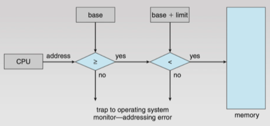
    - This method assumes that memory is assigned in contiguous blocks which is not always the case.

## **Address Binding**

- Addresses are represented as symbolic in source code, e.g. 'string *count*'.
- A compiler 'binds' the symbolic address to a relocatable address, e.g. *x* bytes from the beginning of this module, where the absolute address of the module is known.
- A linker or loader may bind relocatable addresses to absolute addresses once the program is loaded into memory.
- Final binding to absolute memory address can occur at different points:
  - Compile time binding - done by compiler, and if the process needs to be moved to a new memory location then it must be recompiled and reloaded into memory.
  - Load time binding - loader converts relocatable addresses generated by compiler to absolute addresses. Once a program is loaded into memory, the processes must be reloaded if it needs to change location.
  - Execution time binding - binding takes places dynamically during runtime - a relocatable address is only changed to absolute once data needs to be stored. This allows the process to move memory location during run time.
    - Used by most modern OS's and requires an MMU.

## **Logical (virtual) & Physical addresses**

- Logical (virtual)
  - Generated by CPU when reading/writing instructions and data
  - The logical (virtual) address may be different to physical address
- Physical
  - Actual addresses seen by memory unit
  - Any logical address is converted to physical to access the real location
- In compile-time and load-time binding, logical addresses = physical addresses
  - Once program is loaded into memory, the physical addresses of process can't be changed, so CPU can directly access absolute addresses
- In execution-time binding, logical addresses != physical addresses
  - Physical addresses of process can change during run time, but logical addresses must remain the same

## **Memory Management Unit MMU**

- Special hardware required to translate logical addresses to physical addresses
- If processes are given contiguous memory locations, the MMU only contains the relocation (base) register and limit register
  - The logical address is the offset of the base register
  - Limit register contains the largest allowed address - if logical address is greater than limit then a memory addressing error has occurred

# **Memory Allocation**

Deals with how OS allocates and protects memory

## Contiguous Memory Allocation

Each process is contained in contiguous blocks of memory starting from a base address. This was done in old OS, e.g. IBM OS. It uses an MMU with a relocation (base) register and limit register with values decided by OS - where to store a process and how much memory the process is allowed. These registers are only changed by the OS when a process is scheduled for execution and are filled with the correct base address and memory limit for that process.

There are two options for decided how much memory to assign to a process: fixed and variable.

### **Fixed size memory partitions:**

- Memory is separated into fixed size partitions
- Each partition is given to one process
- When a process is terminated, the partition is freed

### **Variable size memory partitions:**

- Any available block of memory is called a hole. These holes are scattered throughout memory and OS keeps track of them.
- When a process is loaded into memory, it is given some memory from a single hole large enough to accommodate it.
- When a process terminates, it's memory is freed, creating a hole. Adjacent holes are always joined to create a single, larger hole.
  - 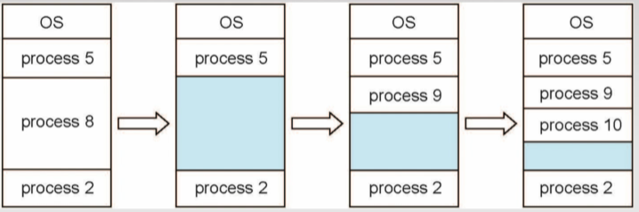
- Dynamic storage allocation problem - which hole to take memory from?
  - First-fit - allocate memory from first hole big enough (fast)
  - Best-fit - allocate memory from smallest hole big enough for process (leaves smallest left-over hole, slow unless holes stored ordered by size and can lead to more fragmentation)
  - Worst-fit - allocate memory from largest hole (leaves largest left-over hole, slow unless holes ordered by size)

### **Fragmentation:**

- Usability of leftover space needs to be considered
- External fragmentation - total memory space exists to satisfy memory requirements but not in contiguous blocks
  - Caused by variable partitioning
  - Keeping track of holes can have high overhead if large number of small holes
- Internal fragmentation
  - Allocated partition is much larger than actual memory used by process

### **Dealing with fragmentation:**

- Compaction
  - Shuffle memory contents to place all free memory into single contiguous blocks
  - Only possible if processes can be relocated during execution, so OS must use execution-time binding
  - Can have large overhead as each time a process terminates, all other processes memory blocks are moved
- Non-contiguous memory allocation
  - Processes memory space is scattered across memory blocks

## Non-contiguous memory allocation

### **Segmentation**

A process' memory is divided into variable size segments.

- Each segment is stored in contiguous memory blocks, but segments aren't stored contiguously
- Each logical address is now a tuple: (segment-number, offset)
- The segment number has a base address and offset completes the physical address
- Segment table
  - Indexed by segment number and has a segment base and segment limit for each
  - Then works as normal in address accessing
- Still causes external fragmentation

### **Paging**

A process' memory is divided into fixed sized blocks called '*pages*'. Physical memory is also divided into fixed size blocks called '*frames*', which are the same size as pages (typically 4KB). Page sizes can be variable in an OS depending on the data stored, but is almost always fixed.

Each page of program is assigned to a frame - all holes are an exact amount of frames, and so all holes can fit an exact amount of pages.

A process's '*page table*' stores the mapping from the process's page numbers to frame numbers and includes all addressable pages, not just the amount the process uses. e.g. a 32 bit address width and 4KB page size gives a page table of 2^20=1,048,576 pages (with 12 bits used for addressing inside the 4KB page as 2^12=4,096) for all processes, even if only a few hundred are used.

Each logical address used by CPU is divided into:

- **Page number** - used to index the page table for the process and find the correct frame
- **Page offset** - combine with base (frame) address to find physical address
- If logical address is m bits and page size is 2^n bits then only the last n bits are used to denote page offset

Paging still causes internal fragmentation, as all page sizes are the same. However, the waste is usually very small as the max wastage must be less than a frame size and the average is 1/2 page size. Smaller page sizes give smaller waste, but larger page tables and overhead so 4KB is the usual.

### **Page Table Implementation**

The page table stores the mapping between page numbers of a process and frame numbers and is stored in memory with the process. It is possible to move the page table to MMU and store it in small fast registers, but this is unsuited to modern systems as the page table has millions of entries.

Page tables are accessed directly from memory by storing the base address of the page table in a register, called the page table base register (PTBR), which is loaded with the base address of a process's page table when that process is scheduled.

Each time the CPU generates a logical address, the page number is added to the base page address to find the correct frame. This means the overhead of memory access is at least doubled, as data is fetched from memory to covert the logical address to physical address from which to fetch more data - essentially two memory calls.

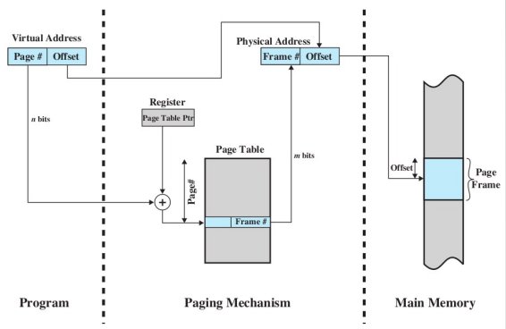

**Translation Lookaside Buffer (TLB):**

A hardware cache to store frequently used entries in a page table, usually < 256. When a logical address is requested by the CPU, the TLB is searched for the page number at the same time as the page table, increasing the speed of finding the correct frame. Searching the entire TLB takes < 1 CPU cycle, adding almost no overhead to the search.

If the page isn't in the TLB, it is a cache miss, and the requested page is added to the TLB by removing an already existing entry.

Cache replacement algorithm - choosing the entry to remove:

- Each algorithm has a hit ratio, the average proportion of the time a page is found in the TLB
  - Popular choice is least recently used (LRU)
- The effective access time (EAT) depends on the hit ratio and memory access time
  - EAT = hit ratio \* memory access + (1 - hit ratio) \* 2 \* memory access
  - e.g. 0.95 hit ratio and 100ns access time gives
    - 0.95*100 + 0.05*2*100 = 105ns

The buffer can store page table entries for multiple process, and for each entry in the TLB there is an '*address space identifier*' (ASID) to identify the process. If the ASIDs match then the frame is returned, otherwise it counts as a cache miss - this is for memory protection.

### **Smaller page tables:**

Smaller tables are beneficial as:

- Reduce memory overhead
- Reduce page search time in case of TLB miss

However, they are hard to use as modern systems use 32/64bit address spaces. With just 32bit addresses and 4KB page size, there are 2^(32-12)=1,048,576 entries in each processes page table. If each entry in a page table requires 4bytes (32 bit address), then the size of a process's page table is 4MB - a lot of memory to just store the page table of a single process. With 100s of process, this is unusable.

### **Page Table Structuring:**

A '*valid-invalid bit*' is used for each page table entry to indicate there is a physical memory frame corresponding to the page number (0 if valid, 1 if invalid). The large majority of page table entries are invalid.

**Hierarchical/multilevel paging tables:**

Divide page table into multiples page tables that each take up a single frame and store them in separate pages - paging the page table.

Have an outer page table that points to the correct inner page table for each page number - can be done multiple times to create multiple levels of page tables, until the outermost table fits in one page. Multiple page numbers point to the same entry.

This reduces amount of page tables required (and memory space used), as if an outer page table has its invalid bit set for an entry, the page table that would correspond to that entry isn’t stored by the OS. Hierarchical page table below uses 3 pages, while the flat table uses 4.
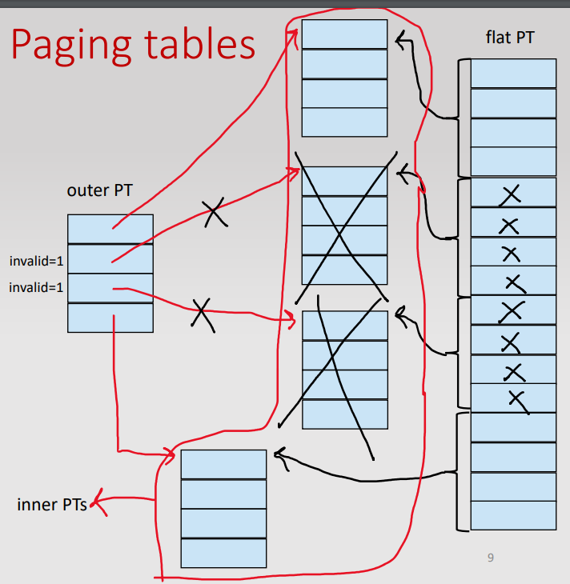

- Example - 32bit addresses, 4KB page size, 4 bytes per page table entry
  - Flat table requires 4MB page table per process
  - To store inner page tables requires 4MB/4KB frames - 1024 frames
  - Outer page tables has 1024 entries of 4 bytes, giving 4KB - fits in 1 frame, no further paging needed
  - As each entry in the outer page table that is invalid doesn't have a corresponding inner page table, the maximum wasted space is 8KB - 4KB from the outer page table and 4KB from an almost empty end page

**Addressing using multi-level paging:**

Assuming 32bit addressing with 4KB pages, then outer and inner page tables both have 10 bits, and page offset of 12 bits. 3 memory accesses required to read memory location (2 is required for flat table).
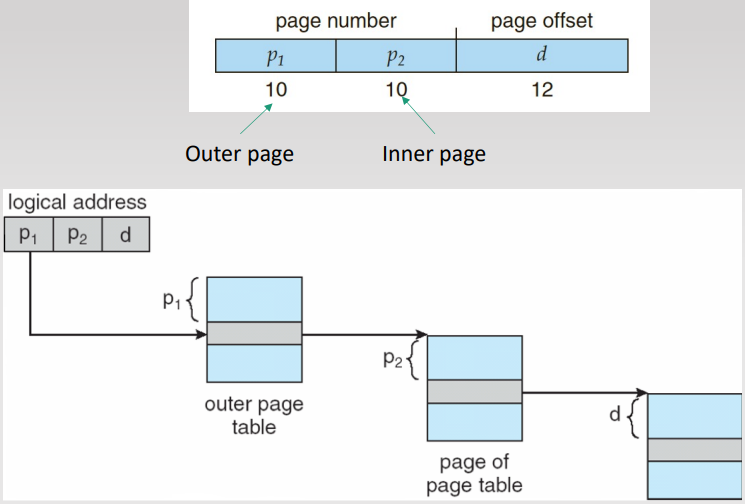

Overall, multi-level paging reduces memory overhead and increases memory accesses required to read/write data in case of TLB miss.

**Hashed page tables:**

Page numbers serve as hash keys and are hashed to an index of the PT. Each entry in a hashed PT is a pointer to a linked list of page numbers having the same hash value. Each node in the list contains the page number, frame number and a pointer to the next node - if the page numbers match then use that node's frame, else check the next node (linear search).
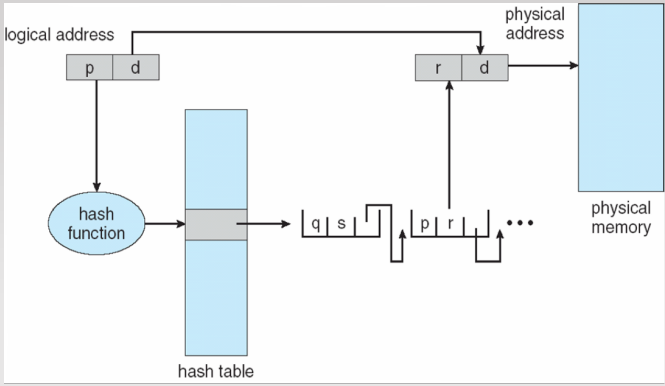

**Inverted Page Table:**

There is a single page table, where each page table index corresponds to a physical frame number. Each entry has a PID and page number (frame is not explicitly stored). When a logical address translated to physical, the table is searched for the process's PID and the requested page number, then the index of that entry is the frame number (base address).

As only 1 page table is required in the entire system, the memory overhead is a lot smaller. However, there is increased time to search as it is linear, and the worst case where the entire PT is searched is extremely bad.

Inverted page tables are not used in modern systems due to their poor performance, but were used by PowerPC and Itanium.
