# Basic Quantum Mechanics

## Atomic Electron Orbital Shapes

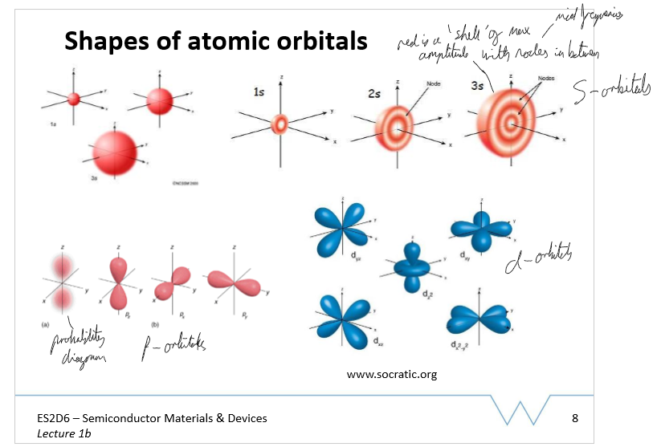

- electron orbital names:
  - s = sharp
  - p = principal
  - d = diffuse
  - f = fundamental/fine

## Madelung's Rule

Energy ordering is from lowest n+l to highest: if n+l is the same, fill orbital with smaller n.

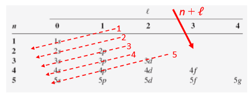

## Pauli Exclusion Principle

- n = principal quantum number (1, 2, 3, ...)
- l = orbital angular momentum (0, 1, 2, ...)
- ml = magnetic quantum number, z component of l, |ml| <= l
- ms = spin magnetic quantum number, 1/2 or -1/2
- pauli exclusion principle: no two electrons in a given system may have all 4 numbers the same

## Hund's rule

- For a given electron config, lowest energy term has the greatest spin multiplicity
- if two or more orbitals of equal energy are available, electrons occupy them first individually, then pair up as more are added

## Orbital Occupancy of first 10 elements H to Ne

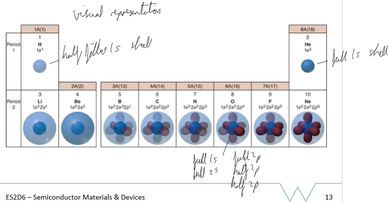

## Heisenberg's Uncertainty Principle

more precisely position is know, less precisely the momentum can be known at the quantum level and vice-versa.

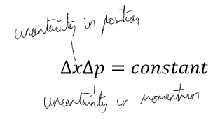

for electron trapped in a 1D (just width) infinite potential well from x=0 to x=a, the uncertainty in position Δx = a. From de Broglie, px=h/λ = ħk or -ħk where k is wave vector 2π/λ and λ=a as fixed length. Δpx=2ħk as ranges from ħk to -ħk. Therefore:

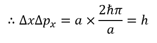 \
h should be ħ for greater accuracy

## Valence shells

Valence shell is the outermost occupied shell of an atom

## Wavefunction

square of the wavefunction is the electron probability distribution, wavefunction is a representation of the orbital

## bonding and antibonding orbitals

wavefunction of atoms close together, the orbitals interact. Can be bonding (additive) or antibonding (subtractive)

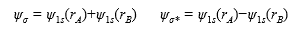

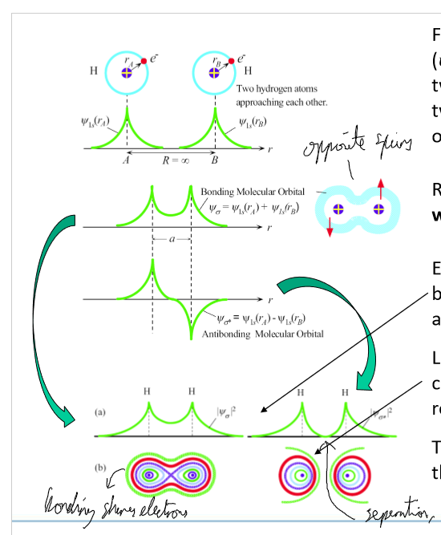

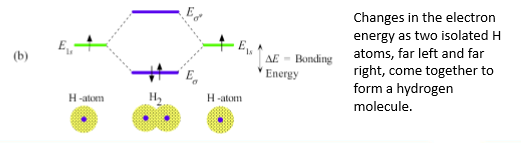

## Energy Bands

Example: Lithium has 1 electron in 2s orbital, so N (assumed large, 1023) electrons in N 2s orbitals. As N atoms are brought together, N energy levels formed as pauli exclusion principle. Max spread of levels when atoms spaced at inter-atomic distance a. The N energy levels form an energy band with 2N states as 2 electrons can fit in each orbital. 2s band is therefore half full.

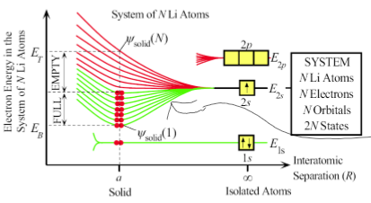

At absolute 0K, bands are full from lowest EB to fermi level EF. Energy needed to excite electron from fermi level to vacuum (escape) is work function Φ of metal.

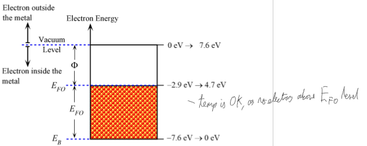

## Fermi-Dirac Function, Fermi levels, Fermi function

f(E) defines probability that a state with energy E is occupied by an electron.

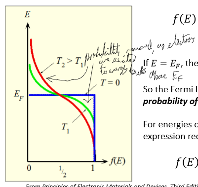 \
as temp increases, greater probability at higher energies and lower probability at lower energies.

## Boltzmann statistics fermi distribution approximation

assume that fermi-dirac function is equal to \
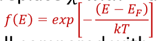

## Semiconductors

- Some free electrons, but not a lot.
- Valence band - full at 0K, bonding orbital
- conduction band - empty at 0K, antibonding orbital
- bandgap between them with energy Eg
- Electrons jump from valence band to conduction band when excited, with holes moving from conduction to valence band

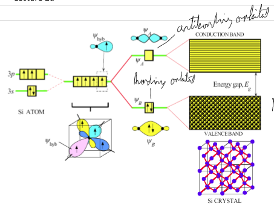

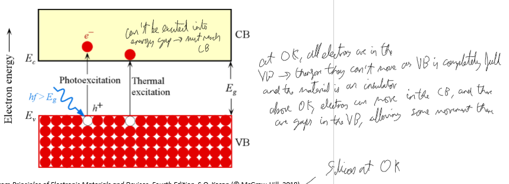\
At 0K, electrons can't move in the VB and there are none in CB so it is an insulator. \
Above 0K, there are some electrons in the CB so some space in the VB and electrons can move in VB, so no longer an insulator.

## Crystal Structures

### Face Centred Cubic FCC

Cubic cell, atom in each corner and in centre of each face. \
Atomic Packing Factor APF = 0.74

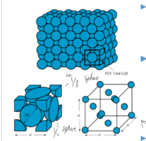

### Body Centred Cubic BCC

Cubic cell, atom in each corner and one in centre. \
Atomic Packing Factor APF = 0.68

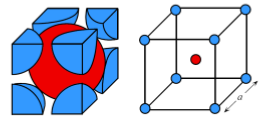

### Hexagonal Close Packed HCP

Hexagonal layers, stacks of triangles. Often two laters of ABAB... but can be 4 of ABCDABCD... \
Can be shown as full hexagons or small 4 with 4 points. \
Atomic Packing Factor APF = 0.74

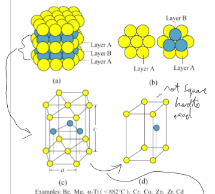

### Diamond Unit Cell DUC

Similar to FCC, but with more atoms placed equidistant from atoms in a quarter of the cube. \
Elemental semiconductors Si, Ge have this structure. \
Atomic Packing Factor APF = 0.34

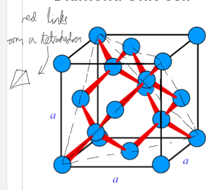

### Zinc Blende Cubic Crystal Structure

Same as Diamond Unit Cell but with 2 different types of atom, example is Zinc Sulphide. \
Many compound semiconductors have this: AlAs, GaAs, GaP, GaSb, InAs, InP, InSb, ZnS, ZnTe

### Bravais Lattice Summary

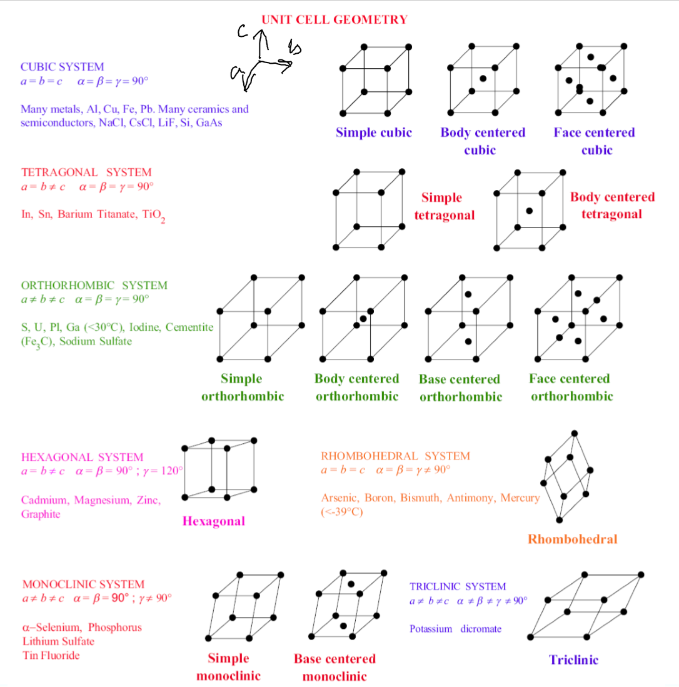

## Crystal Structure Geometry

Miller indices - all parallel vectors have the same indices, exact length directions shown in square brackets, equivalent directions shown in angular brackets.

Calculating Planes: \
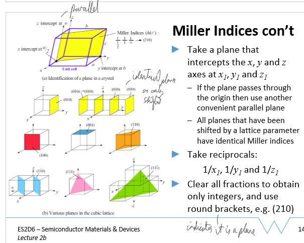

## Intrinsic Semiconductors vs Extrinsic Semiconductors

- intrinsic - almost perfect, few/no impurities
- extrinsic - significant impurities
  - donor - donates electrons, material becomes n-type with electrons as majority carrier
  - acceptor - accepts electrons (donates holes), material becomes p-type with holes as majority carrier

## Electrons and Holes

- electrons - can be treated as free moving in CB, has effective mass me
- holes - can be treated as free moving in VB, has effective mass mh

## Density of States DOS

Density of States g(E) or DOS(E) is such that g(E)dE is the number of states (wave-functions) in the energy interval E to E+dE. The number of states per unit volume up to E' is: \
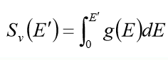

## Electrons in Intrinsic Semiconductor, Concentration of Electrons in Covalence Band CB Intrinsic Semiconductor

Concentration of electrons in CB: \
 \
Subbing in boltzmann approximation of f(E): \
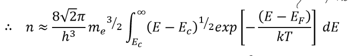 \
Splitting into n and Nc: \
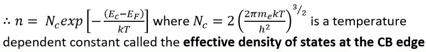 \
Nc is the effective density of states at the CB edge

## Holes in Intrinsic Semiconductor, Concentration of Holes in Valence Band VB Intrinsic Semiconductor

probability of electron = f(e), so probability of hole = 1 - f(e) \
Concentration of holes in VB: \
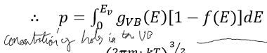 \
This can be reduced to p and Nv: \
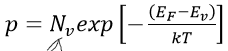 \
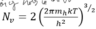 \
Nv is the effective density of states at the VB edge

## Mass Action Law Intrinsic Carrier Concentration

States np = ni2 where ni is the intrinsic carrier concentration. ONLY APPLIES IN THERMAL EQUILIBRIUM AND IN THE DARK. \
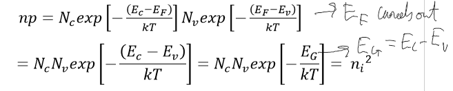 \
np is constant as holes in valence band = electrons in conduction band, and depends on material properties Nc, Nv and Eg. \
Can multiply out Nc and Nv and others to get: \
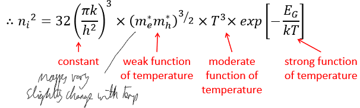

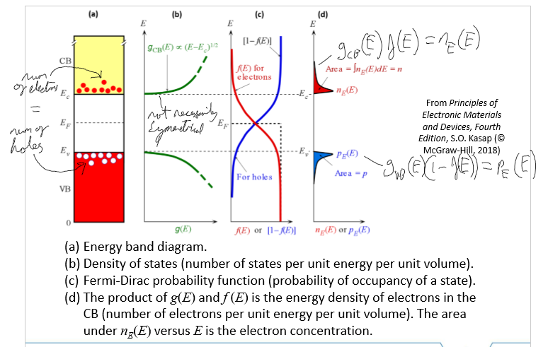

Materials considered intrinsic if ni >> doping concentration.

## Intrinsic Carrier Concentration vs Temperature

As temp increases, intrinsic carrier concentration also increases: \

## Fermi energy in intrinsic semiconductors fermi level instrinsic

- 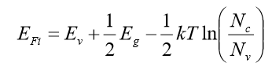 \
- EFi = fermi energy, where f(E) = 0.5
- Ev = top edge of valence band
- Ec = bottom edge of conduction band
- Eg = Ec - Ev
- k = boltzmann constant
- T = temp in kelvins
- Nc = effective density of states at CB edge
- Nv = effective density of states at VB edge
- if Nc = Nv:
  - 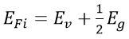
  - fermi energy is midpoint of the energy gap
- as 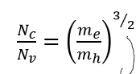 we can write:
  - 
- multiplying out Nc and Nv and others:
  - 

## Doping N-Type

Add impurities with larger amount of valence electrons than original material to produce "free electrons", e.g. adding Sb to Si crystal as Sb has 5 valence electrons and Si has 4. \
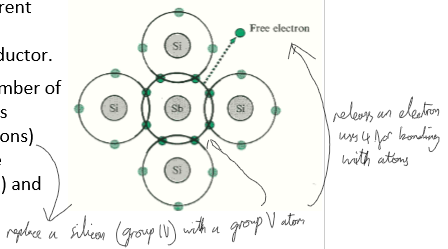

Si doped with As: \
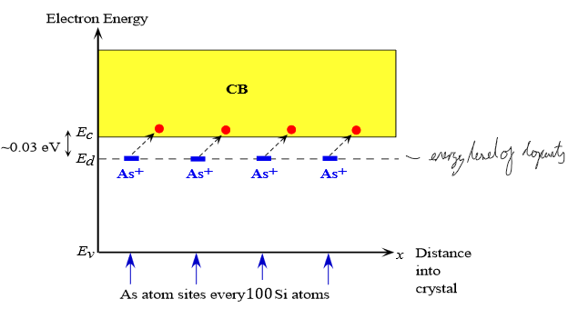

## Doping P-Type

Add impurities with less valence electrons than original to add "holes". e.g. adding B to Si as B has 3 valence electrons and Si has 4. \
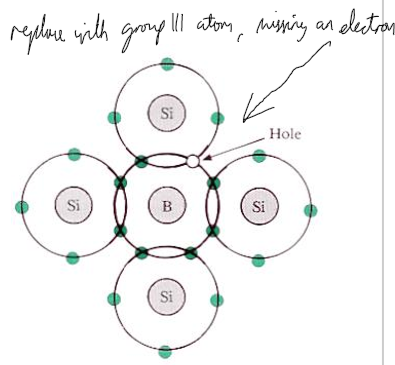

Si doped with B: \
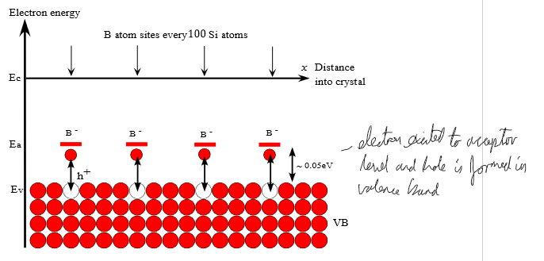

## Binding energy

Binding energy of donor carrier (swap Me for Mh for holes) in material (orbits around donor atom until this energy met):\
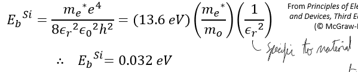

## Majority Carrier and Majority Carrier Concentration in Doped Semiconductors

Electrons and Holes are carriers of charge. Whichever carrier is present in the largest number is the majority carrier: **Holes in p-type, electrons in n-type**. The other is the minority carrier.

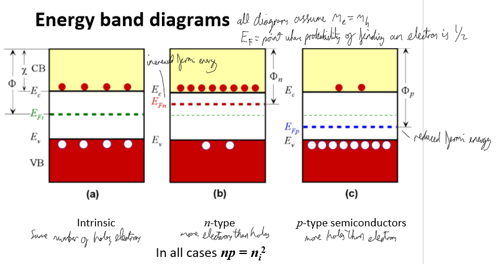

ND = electron donors, NA = electron acceptors
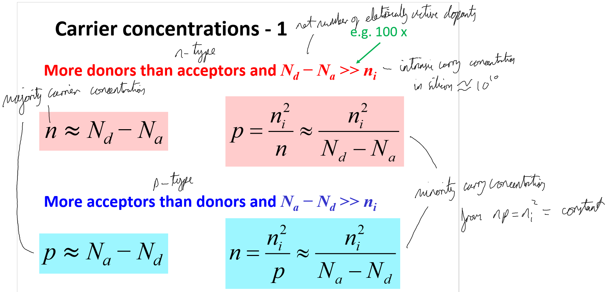

If |ND - NA| ~ ni2, then: \
N-type: 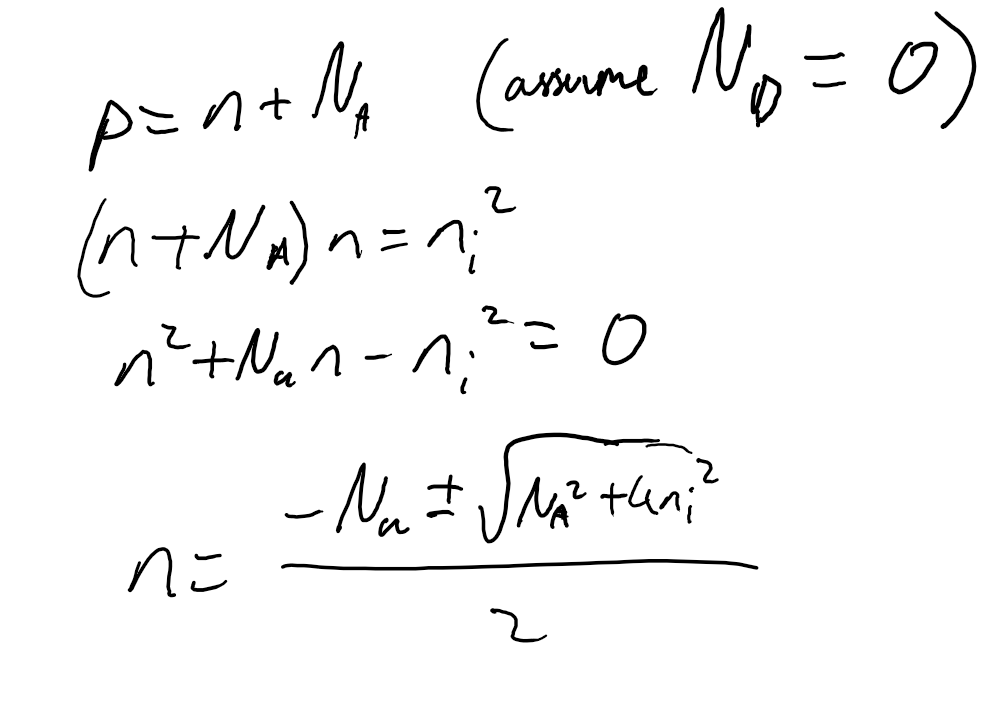 \
P-type: 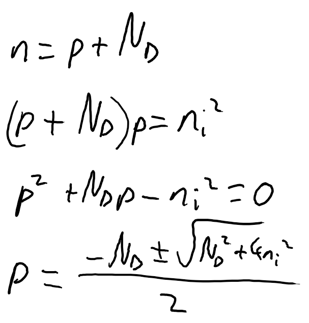

## Majority carrier concentration in Doped Semiconductors Against Temperature 1/T

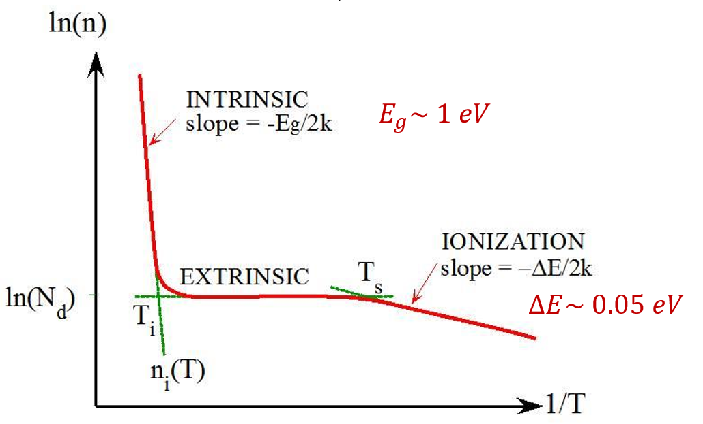

## Degenerate Semiconductors

If doping very high (1019cm-3+ in Si), can no longer use Boltzmann statistics and must use full Fermi-Dirac Equation as fermi level may lie within CB or VB. Therefore, np=ni2, n=Nd and p=Na are not valid.

## Compound Semiconductors III-V Semiconductors 3-5 Semiconductors

Have group III (3 electrons in valence) and group V (5 electrons in valence) in a unit cell bonded, most likely in zinc blende crystal structure. Acts as 'intrinsic'. Doped: \
N-type by replacing V atoms with VI atoms (as VI is more similar to V than III) \
P-type by replacing III atoms with II atoms (as II is more similar to III than V) \
Doping with IV is ambiguous as could replace V or III, unknown doping outcome.

## Typically Semiconductor Properties Si SiC Ge GaN GaAs InGaAs InAs InSb

## Semiconductor uses with different band gaps

### Wide band gap uses Eg > 2.5eV

typical semiconductors: SiC, GaN, InGaN \
electronic uses: high power/temp electronics as more stable: electric vehicles, grid power, radar, high voltage switching
optical (III-V) uses: white light and UV light sources: LEDs and lasers

### Intermediate band gap uses 2.5eV > Eg > 0.6eV

Typical semiconductors: Si, Ge, GaAs, GaP, InP, InGaAs \
electronic uses: all modern electronics (transistors, diodes, etc)
optical (III-V) uses: visible/high IR LEDs, lasers, detectors and solar cells

### Low band gap uses 0.6eV > Eg

Typical semiconductors: Sn (alpha), GaSb, InAs, InSb \
electronic uses: magnetic sensors, high frequency electronics
optical (III-V) uses: mid IR LEDs, lasers, detectors

## Electric Current Density Jx and Drift Velocity vdx (classical)

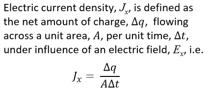 \
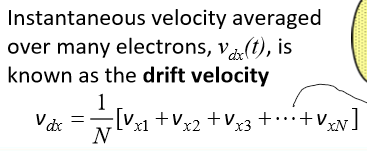 \
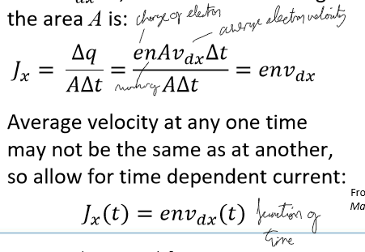

Using v=u+at for electrons and u=0 due to scattering: \
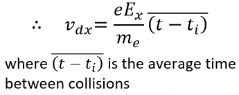

Mean free time (relaxation time) is time between collisions, so: \
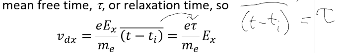

Drift mobility ud is a constant of proportionality, can be subbed into vdx and Jx: \
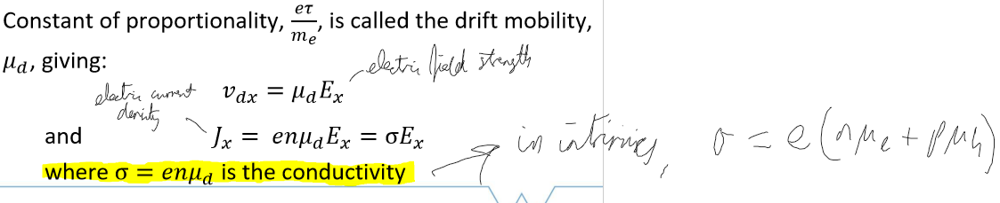

Electrons and holes have individual mobilities: \
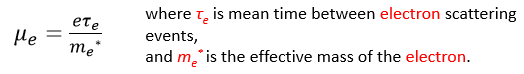 \
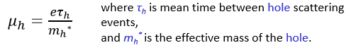

visual of why Ex causes current to flow (it effectively causes the bands to bend, band bending):\

conduction current or total current density J can be split into electron and holes: \
 \

This assumed: relaxation time independent of electric field, all electrons have same mass, avg velocity of any 1 electron = avg of all electron velocties. \
Reasonable assumption for metals/large semiconductors. Doesnt work for small devices with small number of carriers/short distances for electrons to travel, high electric fields so saturation velocity reached, high doping so mass not the same for all electron/hole concentrations.

## Drift mobility temperature dependance

\
see lattice impurity scattering and lattice vibration scattering for why the below graph occurs: \

## Thermal Velocity

Typically thermal velocity >>> drift velocities in metals: semiconductors allow for drift velocities comparable to thermal velocities.

## Scattering Processes

### Matthiessen's Rule

Scaterring occurs due to thermal lattice vibrations, impurities and crystal grain boundaries (from impurities/imperfect growth). Matthiessen's Rule gives total scattering probability and total drift mobility. \

### Lattice Vibration Scattering (classical)

 \
S = cross-sectional area of the scatterer \
Vth = thermal velocity of carrier \
Ns = number of scatterers per unit volume (m-3) \
 \
a = amplitude of the atomic vibrations about the equilibrium, a2 is proportional to temp T \
S = pi*a2

### Lattice Impurity Scattering Impurities Scattering

## Recombination Processes

Free electron finds an incomplete bond, moves from CB to VB. At above 0K thermal excitation constantly moves electrons from VB to CB, and in equilibrium electrons must move from CB to VB at same rate. Excess energy from recombination lost as photon.\
 \
k = wavevector, 'direction' of wave. Momentum must be conserved, so when electron moved from CB to VB must keep the same k. \
 \
Left: direct bandgap, electrons in base of CB have same k as holes in top of VB. \
Right: indirect bandgap, electrons in base of CB have different k to holes in top of VB.

summary (no details): \

### Radiative Recombination

Needs direct bandgap, electrons move direct from bottom of CB to top of VB and keep the same k.

### Shockley-Read-Hall Recombination SRH Recombination

Electrons moves (is captured by) from CB to a SRH recombination centre between the CB and VB, and then the SRH centre captures a hole from VB and electron moves to VB. Accommodates momentum mismatch by absorption/emission of phonons (lattice vibrations). SRH centres are impurities or crystal defects, so have different bandgaps to rest of material. \

Trapping: Similar to SRH, trapping centre takes in electron from CB and holds it, then releases it back to CB when excited. \

### Augur recombination

Electron and hole have different k and recombine, energy from different k's is transferred to another electron which has an opposite change in k to the recombining electron. Energy is slowly lost by thermalisation. \

## Minority Carrier Lifetime

Rate of recombination of excess carriers is dependent on density of carriers, giving exponential behaviour of minority carrier lifetime. \

### Transient photoconductivity

Gph is the generation rate per unit volume caused by illumination (photogeneration). \

### Radiative recombination rate low level injection

 \
In thermal equilibrium np = ni2, so Re=Gth and net rate is 0.

For doped semiconductors (swap n and p to get p-type): \
 \
minority carrier lifetime inversely proportional to doping concentration

### Shockley-Read-Hall recombination rate SRH recombination rate low level injection

 \
Et is SRH energy, Nt is number of SRH centres \
Rate maxed for Et=Ei, mid-gap energies are most effective, assume this is true: \
 \

For doped semiconductors (swap n and p to get p-type): \
 \
ni is removed from bottom as ni << p/n in doped materials \
minority carrier lifetime inversely proportional to SRH centre concentration

### Augur recomb rate low level injection

 \

for doped semiconductors (swap n and p to get p-type): \
 \
minority carrier lifetime inversely proportional to doping concentration squared

## High level injection recombination rate for radiative, SRH, Augur

## Ideal Diodes

Formed from pn junction of differently doped materials. \
Ideal Diode under forward bias, see depletion layer and pn junction for why: \
 \
Ideal Diode under reverse bias: \

## Depletion Layer

With no external voltage, pn junctions will form a depletion layer where holes and electrons recombine as they thermally diffuse between the materials. \
 \
This causes the depletion layer to become charged - excess positive ions on the n-type side as electrons are removed and excess negative ions on the p-type side as holes are removed. This causes a barrier potential to be formed until equilibrium is reached - stops more movement of electrons and holes when no external voltage. \
 \
This is barrier potential or built in voltage: \

Thickness (W or Wo) dependant on doping, depletion layer lies majority inside lower doped side of junction. \
Assuming symmetrical doping, depletion layer thickness under no external voltage: \
 \
Under external voltage (forward is positive): \

Capacitance of depletion layer or depletion layer capacitance: \

## PN junction band diagram

 \
As connected the fermi levels must the same, so bands bend to accomodate this.

## diffusion limited ideal diode under forward voltage bias

 \
Voltage mostly dropped across depletion layer as neutral regions have high carrier concentrations. Reduces the Vbi, so more carriers diffuse - more current. Amount of new carriers: \
 \
 \
 \
Swap h for e and p for n to get p-type side excess electron density. Sum of Jhole + Jelec is constant, as current must be constant throughout the diode. \
 \
for given diode at given temp, only change is due to voltage change. \
For larger V, so 1 << exp(eV/kt): \

## diffusion limited ideal diode reverse bias

 \
If V is negative (reverse bias), then right side of equation tends to -1, and J tends to -Js.

## diffusion capacitance ideal diodes

When forward bias, minority carrriers are injected into neutral regions. They take some time to combine, giving extra diffusion capacitance. \
 \
Under forward bias, diffusion capacitance is typically in the nF range and is much larger than depletion capacitance.

## Dynamic resistance or differential resistance

## non-ideal diodes or real diodes

### short diodes

length of p-type lp and n-type ln regions are shorter than the diffusion lengths of carriers Le and Lh. \
 \
at distance from depletion region x'=0 the carrier conc is the same and must be 0 when x'=lp or n, so linear change as few carriers lost to recombination due to neutral region << diffusion length. \
Current density (swap p and n, h and e for p-region): \

## recombination in the depletion layer or depletion layer recombination

Some carriers recombine in the depletion layer and are replenished by external current. \
 \
 \
More rigorous analysis (actual equation): \

## generation in depletion layer - reverse bias

Reverse bias causes wider depletion layer. In addition, thermal generation of electron-hole pairs can occur in the depletion layer: \

## characteristics of diodes: IV I-V characteristics

 \

## diode summary

## diode breakdown - avalanche breakdown

electric filed over depletion layer large enough that electron gain kinetic energy to break a bond, forming another electron-hole pair. \
 \
breakdown voltage: \
 \

## zener diode - zener breakdown

heavily doped pn junction - apply reverse bias and Ec on one side may be lower than Ev on other side. If gap between p and n materials is small enough, electrons then tunnel from one to the other: \

## Schottky diodes

metal joined to semiconductor. electrons in semiconductor move to metal as there are higher energy VB states they can easily get to. electrons accumulate on metal-semiconductor edge, giving electron depletion region of width W containing positively charged donors and no free electrons. \

no external voltage: \

forward bias: \

reverse bias: \

used in high-frequency applications. can be used as photodidoes under reverse bias and even respond if photon energy less thgan bandgap by jumping from edge of metal VB to semiconductor CB.

### ohmic contacts

if metal has smaller work function than semiconductor, no barrier is formed and no restriction to flow current. \

## photodetectors or photodetection

photon with energy > Eg absorbed, so electron moves from VB to CB. high energy photons make electrons move to high levels of CB which lose energy through phonons until within 3kT/2 of band edge. \
alpha is the absorption coefficient. if photon energy = Eg, alpha is low as low amounts of electrons at VB edge and low amount of free states in CB. \
if photon energy > Eg, alpha is higher as more electrons that can be moved to CB and more states in CB that electron could be moved to. \

## optical absorption beer-lambert law

## photoconductor

single material, like resistor. incident light causes generation (photogeneration): \
 \

## photodiodes

Illuminated so photons go through depletion layer and neutral regions. Largest current from photon absorbed in depletion layer as carriers moved by field, if absorbed in neutral then reliance on diffusion. Reverse biased pn junction to give wider depletion region. \
 \

## pin photodiodes or p i n photodiode or p-i-n photodiodes or pnn or p-n-n

increased deepletion region width by having lightly doped/intrinsic region between p and n regions. \

## signal to noise ratio or responsivity and detectivity

## solar cells or photovoltaics

similar to photodiode, but no applied voltage and changed to most efficiently produce voltage/current: \

very thin n region so more absorption in depletion/p region. open circuit voltage develops between terminals as electron hole pairs are formed and drift/pushed to respective sides. \
terminals shorted: Isc flows. useful volume of solar cell: \

electrons generated by high energy photons (high alpha) in the n-region are often lost to recombination due to high doping - significant efficiency decrease. long wavelengths also can't be absorbed and low evergy photons < Eg are lost as heat as cant be absorbed - can be 25% of energy in Si. reflection loses 10-20% of energy, but surface texturing/antireflective coating decreases reflection.

 \
 \

### fill factor

### tandem cells multi-junction cells multiple junction cells

grow multiple np junctions with tunnel junctions between them. np juncitons have different Eg so more photons absorbed in good areas. very expensive, usually 10s of cm2: \

## solar cells summary

## LED light emitting diode

forward biased junction - injected majority carriers allowed to pass into opposite region, becoming minority carriers and so recombine rapidly. recombination releases photons equal or greater in energy to Eg of p-region.

## double heterostructure LED

two junctions with different band gaps - typical stack is np1p2. when no voltage, electrons stay in n CB and there are no holes in VB - no recombination. when forward bias, electrons move from n to p1 (which is short) and can then recombine with holes in VB. \

n has larger Eg than photons released, so not reabsorbed.

## single quantum well diode SQW diode

Thicnkess (d) of central active region reduced to get better recombination rates until quantised energy levels formed in z direction. \
 \
1D potential well in z direction, free to move in xy directions. En is the electron energy at level n: \

forms 2D electron gas (2DEG) in well. density of states is constant at E1, E2, etc so large number of states are available at lowest energy. can be swamped by carrier - use multiple quantum wells, succession of SQW in series.

## LED materials and larger structure

III-V alloys: covers lower end of spectrum to green \
III-Nitrides cover green+ and UV \
 \
use dome to prevent TIR and textured surface to prevent TIR.

## LED light emission or LED spectrum of light output or electron energy distribution

 \
 \
 \

## Diode lasers

particle in upper state reacts with photon matching energy seperation of levels, the particle decays and releases another photon in the same phase and frequency as incident photon - stimulated emission. \
requires population inversion - most electrons are excited, done using another optical source or by carrier injection - extreme doping so that fermi level is inside conduction band. \
This is a degenerate material, cant use boltzmann statistics: \
 \
feedback needed to make laser - add mirrors at each end.

## laser modes

standing waves formed in lasers: \
 \

## double heterostructure laser diode

## seperate confinement heterostrucutres SCHs diode

## vertical cavity surface emitting laser VCSEL

## diode vs laser power

## Hall Effect

 \
hall field EH: \
 \
hall field diagram: \
 \
hall coefficient RH: \

hall coefficient using drift mobility: \
 \
hall coeff with scattering effect: \

used to measure magnetic fields, effective use in rotating systems and contactless sensors. Useful in vehicles, phones, current sensors, etc.

## Wavefunction, Schrodinger's equation, wave particle duality principle

Describes dynamic behaviour of quantum system. \
 \
 \

can become time independent: \

## interpretation of wave function: electron momentum, wavenumber, de broglie wavelength

## electron energy and electron kinetic energy and group velocity - slope of E(k)

 \
relating electron kinetic energy and velocity: \

## bloch theorem

periodic solids give periodic electron potentials: \

wavefunction contains unit cell part and planwave part - subbing bloch funciton in for unit cell function: \

## Kronig Penney Model

 \
solving for wave function: \
 \
boundary conditions for kronig-penney: \
 \
solving the boundary conditions to find the brillouin zone, values of k before which the periodicity starts: \
 \
plotting this for 1 brillouin zone and then limiting it to values between -1 and 1 gives allowed energy values, forming the bandgap when unfolded to more brillouin zones: \

## Effective mass of electon and effective mass of holes

 \
effective masses affect band structure and band gaps. Also effects energy and velocity for a given wavevector: \
 \
Effective masses change depending on direction and material

## typical semiconductor effective masses

 \

## basic band theory summary: band gaps, periodicity, effective mass

## First brillouin zone: all allowed k-space fits in first brilluoin zone

## Si 3D specifics, Si brillouin zone, Si first brillouin zone

## Density of states for k-space, k-space DOS, DOS of k-space, 3D DOS, g(E)

 \
3D DOS: \
 \
 \
2D DOS: \
 \
1d DOS: \

## converting ellipsoid mass to sphere, Mdos, Mdos-sph

 \

## conductivity effective mass Mcond

## effective density of states, carrier concentration calculation alternatives

## Drift and Diffusion

 \

## Fick's Law

## Drift current

 \
At low Efield: \

## Mobility or drift mobility

## Resistivity and Conductivity

## Einstein Relations, Einstein's relation

relates diffusion coefficient to mobility and dimensions: \
 \

## Recombination - Generation Centres (SRH centres)

 \
use time constants and get more general result: \

## Continuity equations

## minority carrier diffusion equations

 \

## carrier action summary - drift, diffusion, mobility, einstein's relation, continuity, minority carrier diffusion

## boltzmann transport formulation, BTE

The function f(x, v, t) describes the positions, momentum/velocity of particles at time t, i.e. how many electrons at time t are located at position x and have velocity v. Current can then be computed from: \
 \

## boltzmann transport with scattering, BTE with scattering

 \
drift and diffusion with BTE: \

## drift current with BTE and displaced distribution

 \
displaced distribution: \
 \
finding flux (sum of all k-states times velocty of each state): \
 \
finding current from flux, then moving from k-space to energy-space: \

transport distribution function and reduced drift current from BTE: \
 \
due to df/dE, only carriers near EF contribute when using BTE

## diffusion current with BTE

start from full BTE and find flux: \
 \
diffusion current from flux and diffusion coefficient: \
 \

## Scattering rates, scattering times, relaxation rates, relaxation times

elastic, inelastic, isotropic, anisotropic: \

## phonon scattering

phonons are lattice vibrations, move atoms in non-uniform way to strain bonds and change bandgap: \

## ionized impurity scattering and screening

Brooks-Herring equation: \
 \
strength of screening defined by screening length LD - smaller it is, more strongly impurity is shielded and lower scattering effect.

## boundary scattering

## surface roughness scattering rate SRS

## alloy scattering

occurs in compounds due to different potential variations in band: \

## scattering rates summary

## Momentum relaxation rate

## thermoelectrics

 \
current from combined voltage and temperature: \
 \
change in fermi by change in temperature: \

simplified current from voltage and temp difference with flux: \
 \
seebeck voltage Voc and seebeck coefficient S: \
 \
 \
power factor, S2G: \
 \
ZT figure of merit: \
 \
calculating ZT figure of merit: \

summary of thermoelectrics, thermoelectrics summary, k=ke+kl: \

conductivity and seebeck relation: \

## MOS capacitors

MOS capacitor structure: \
 \
MOS off, on: \
 \
 \
MOS bands with no bias: \
 \
MOS bands with bias, surface potential, distance from instrinsic to fermi level, MOS states p-type: \
 \
 \
MOS charge profiles: \
 \
MOS states n-type: \
 \
capacitance of MOS, MOS capactiance: \
 \

MOS CV characterstics at accumulation: \
 \
MOS CV characteristics at depletion: \
 \
MOS CV characteristics at inversion: \
 \
MOS CV summary: \

MOS voltage drop and MOS surface potential: \
 \
MOS quantum capacitance: \

## semiconductor growth techniques

bulk growth: \
 \
epitaxial growth: \

summary: \

## defects in crystals

### vacancies defects, vacancy defect

Site expected to have an atom doesnt: \

### Edge dislocations

### Screw dislocations

### misfit dislocation and threading dislocation

 \
creates lines of electrically active defecets, e.g. dopants or SRH G-R centres. Can be grown out using intermediate buffer layers to reduce strain

### surface defects

## semiconductor fabrication techniques, semiconductor device fabrication

dont have time, read the slides

## optical and xray techniques

dont have time, read the slides, small summary at **scanning techniques summary**

## electron microscopy, electron microscopes

dont have time, read the slides, small summary at **scanning techniques summary**

## STM, scanning probe, SIMS, 

dont have time, read thee slides, small summary at **scanning techniques summary**

## scanning techniques summary

## bipolar transistor design and characteristics, BJTs

basic design: \
 \
bjt transport (pnp): \
 \
bjt emitter current pnp: \
 \
emitter injection efficiency and base transport factor: \
 \
common base current gain and current transfer ratio: \
 \
base current: \
 \
beta, ratio of collector to base current: \

## BJT transistor amplifier, pnp amplifier

voltage amplification, input resistance, output signal: \
 \
full small signal input resistance: \
 \
full voltage amplification: \
 \
transconductance or mutual conductance gm: \
 \
heterostructure BJTs, HBTs: \

## JFETs, junction FET, junction field effect transistors

n channel JFETS structure: \
 \
n-channel jfet workings Vgs=0: \
 \
reverse bias Vgs, if Vgs > Vp the channel is totally depleted and transistor is off except for small leakage from thermal: \
 \
JFET output characteristics: Ids vs Vds, Ids vs Vgs: \
 \
 \
JFET as common source amp, transconductance gm and small signal transconductance: \
 \
jfet voltage gain common source amp: \
 \

## MESFET and MODFET

### MESFET MEtal Semiconductor FET

similar to jfet in operation: \
 \
mesfet equations, mesfet transconductance, mesfet current: \
 \
mesfet critical field: \

### MODFET MOdulation Doped FET

used in highfrequency applications, solves problem of low mobility from high doping: \
 \
modfet equations, modefet characteristics: \

## enchancement mode MOSFET metaloxide semiconductor FET

enhancement mosfet structure, enchancement mode means normally off: \
 \
mosfet Id vs Vds and Vgs: \
 \
mosfet saturation region and transconductance: \

semi-empirical for full output - bridge linear and saturation: \

## depletion mode MOSFET metaloxide semiconductor FET

depletion mosfet structure: \
 \
depletion mosfet d-mode e-mode states: \
 \
CMOS, complementary MOS, inverter, nMOS: \
 \
CMOS equations, figures of merit, sub-threshold swing: \
 \
drain induced barrier lowering DIBL: \
 \
scaling issues: \

## subband quanitzation and low-dimensial channels

