# Combinatorial Logic

## Intro to Combinatorial

**Combinatorial Logic:** combines inputs in some way to generate an output without depending on any other factors (including previous inputs). For a given set of inputs there can be only one output.

Combinatorial circuits can have multiple layers, creating a hierarchy where there are sub-combinatorial elements:

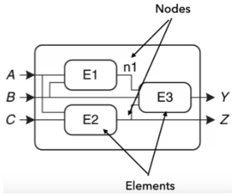

If there are any non-combinatorial elements, multiple nodes connected to the same input node or cyclic paths then the circuit is no longer combinatorial.

### Basic Boolean Algebra

- AND = ·
- OR = +
- XOR = ⊕
- NOT = ’

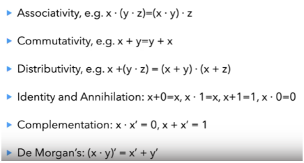

**Karnaugh Maps:** Alternative to truth tables where adjacent cells differ in input values by only 1 bit, allows simplification of a logic expression by finding groupings in sizes of powers of 2:

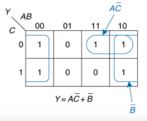

Y = A’B’C’ + A’B’C + ABC’ + AB’C’ + AB’C is reduced to Y = AC’ + B’

Minterm: a distinct input array where the overall output can be defined as the sum of the minterms which result in an output of 1, e.g.

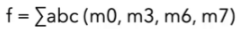

## Common Combinatorial Circuits

### Multiplexer (Mux)

Control signals decide which input should be connected to the output. Multiplexers can also be used to build logic functions by setting the inputs as constant and varying the control signals.

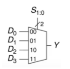

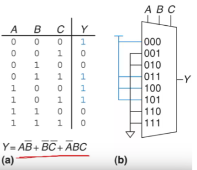

### Decoders

Use k input bits to produce 2^k output bits where one is active (high/low) and the others are inactive (low/high). Useful for accessing memory addresses.

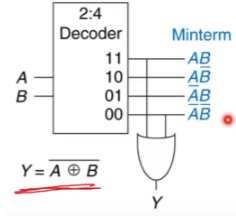

### Priority Encoder

Equal number of input and output bits where there is an order of priority for the input bits, and the output bit corresponds to the highest priority input that is active.

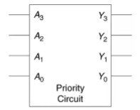

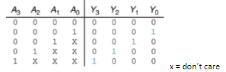

# Sequential Logic

## Intro to Sequential

**Sequential Logic:** inputs and memory are combined to create the output. Previous inputs affect the current output.

## Basic Sequential Circuits

### SR-type latch

The simplest circuit for storing one bit of data. Setting R high sets the output to 0, setting S high sets the output to 1, setting both high sets Q and Q' to 0, setting both low retains Q and Q' from the previous output.

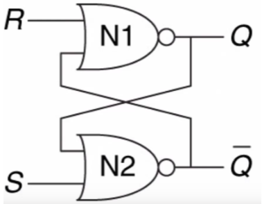

Unpredictable behaviour occurs if both S and R are 1, then both are set to 0 at the same time. The output will be stable but is uncertain.

### D-type latch

This extends the SR-latch to fix the unpredictable behaviour by ensuring that R and S will have different inputs. Also introduces a CLK signal that controls when the output of the latch is updated.

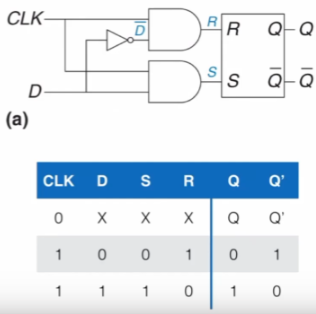

### Flip-flop

Made from 2 D-type latches linked together in the basic form. The output only changes to match D on the rising edge of the clock from 0 to 1 as while CLK = 1 the master D-type no longer changes its output to match D.

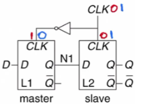

Also drawn as:

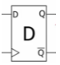

### Registers

A bank of flip-flops with a common clock can act as a register to store multiple bits that can be accessed in parallel.

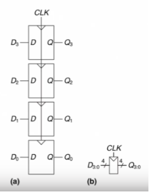

Shift-registers are a chain of flip-flops passing data from one to the next at each rising edge, and can be accessed in parallel or sequentially by reading only the final bit each clock.

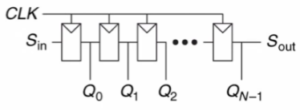

### FIFO Buffer

Formed by connecting whole registers in the shift-register pattern - a multibit input/output shift-register.

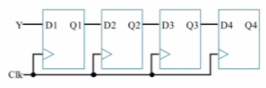

### Counters

Generates a sequence of outputs, typically a rising/falling sequence of binary numbers changing by 1 each time.

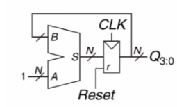

### Synchronous Memory

To store more data, multiple registers share an output data line. Addressing inputs signals allow different registers to be accessed and connected to the output data line. An address signal with N bits can differentiate between 2^N registers/memory locations using a decoder.

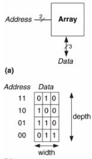

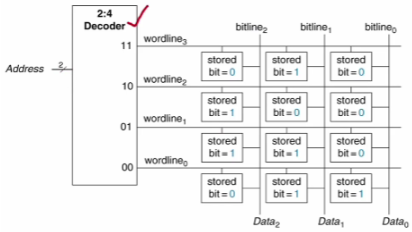

## Clocks

Oscillate between 0 and 1 at a fixed frequency. The period of the clock is the time to complete 1 cycle - the time between rising edges. The oscillations are often created using an external crystal oscillator. For low-level digital design there is typically a single clock in the system that all sequential components use. For more complex designs, there is a single source clock which is then used to generate multiple clock signals to allow for sequential circuits to have different frequencies.

# Verilog (combinational)

Verilog is a hardware description language - code which describes logical functions which are implemented using LUT in an FPGA. Designs are broken into modules, separate files that encapsulate some functionality. The modules can create instances of other modules for use within the module, with good designs having levels of hierarchy.

## Verilog Basics (structural)

**Identifiers:** Names of modules, signals, ports, registers, etc. They must start with a letter, can contain letters, numbers and underscores and can't be the same as a keyword.

### **Modules**

Each module is declared with the `module` keyword and a list of ports - the inputs/outputs to the module. Modules are instantiated using the module name, an identifier for that instance of the module and then the arguments. These are in the form `.x(y)` where `x` is the identifier in the module definition and `y` is the identifier being passed to the module.

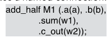

Modules can also contain parameters inside the definition or regular text. Parameters are constants local to the specific instance of a module and have default values that can be overridden on instantiation.

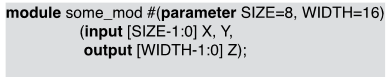

### **Gates**

The basic gates are inbuilt to verilog: `and`, `or`, `not`, `nand`, `not`, `xor`, `xnor`. These are called using their names, typically in the form:
`and andgate1 (outputwire1, inputwire1, inputwire2);`

Verilog multiplexer example:

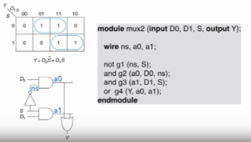

### **Multibit Signals**

Inputs, outputs wires and registers can be multibit. These multibit signals are called vectors, and are defined by specifying a range of bits from MSB to LSB:

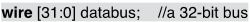

By setting LSB above 0, the resolution of the signal is reduced, but can allow for a greater max value for the same about of bits. Vectors can also be indexed to select ranges/individual bits from the vector, e.g. `assign y = some[3]` sets `y` to the 4th from LSB bit of `some` and `assign z = some[4:3]` sets `z` to the 5th and 4th from LSB bits of `some`.

Vectors also allow assignments of mismatched vectors - e.g. a 4 bit wire is connected to a 2 bit wire. This does not produce any syntax errors and the left over bits are ignored or set to 0, but can produce logic errors.

### **Number Literals**

Constant numbers are specified in verilog using the format: \<`size`>'\<`radix`>\<`value`>. `size` is the amount of bits required to store the number in binary and `radix` refers to the numerical system used - `o` for octal, `b` for binary, `h` for hexadecimal, `d` for decimal. e.g.

- 4'b000 = 4 bits storing binary "0000"
- 8'h4F = 8 bits storing hex "4F" = 8 bits storing binary "01001111" = 8'b0100_1111 (underscores can be used for easier reading)
- 4'd11 = 4 bits storing decimal "11" = 4 bits storing binary "1011" = 4'b1011

### **Concatenation & Replication**

Concatenation is used to string together multiple signals into a single wider signal. This is done using `{}` enclosing a list of signals to be concatenated in the order they appear.

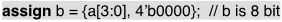     `b = a``3``a``2``a``1``a``0``0000`

Replication is used to copy signals and concatenate them to create wider signals, e.g. `4{a[3]} = a``3``a``3``a``3``a``3`.

### **Assign**

**Assign:** The `assign` keyword is a continuous assignment where the result is a combinatorial function of the inputs - no clocks are necessary and it is simpler than using gate modules.

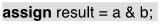

This uses inline bitwise operators which are then simplified at compile time to the most efficient use of logic gates/LUTs, as well as allowing for basic arithmetic expressions:

- bitwise
  - `&` - and
  - `|` - or
  - `^` - xor
  - `~` - not (can be used in front of other bitwise operators, e.g. `~|` is nor)
- multibit
  - `+` - addition
  - `-` - subtraction
  - `*` - multiplication
  - `/` - division (can only be used in specific cases, isn't generally synthesizable)

**Conditional Assignments:** The same as a ternary operator in C, where a value is checked and assignment made based on that value.

All general comparators work and are multibit, e.g. `<`, `>`, `>=`, `<=`, `==`, `!=`.

### **Primitives**

Verilog allows the creation of primitives, essentially custom logic gates. This is done used a truth table which defines the single output in relation to the inputs. The single output port must be the first port listed in the primitive description.

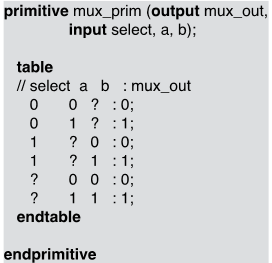

### **Adders**

Simple half adder in Verilog:

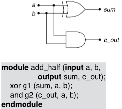

Full adder truth table and Verilog implementation using instantiated half adder:

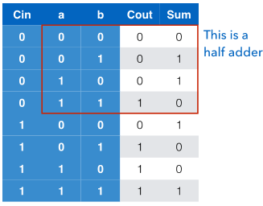

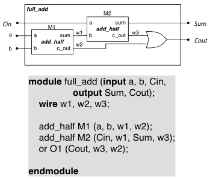

Full adder using `assign`:

~[adder using assign](adder_assign.png)

## **Behavioural Verilog**

Attempts to describe how the circuit behaves as opposed to directly defining the functions required. The implementation tools that interpret the Verilog code design hardware that fulfills the required behaviour. This can be combinational or or sequential.

### **`always` block**

An `always` block contains procedural (in order) or synchronous (not combinatorial) statements that are run when changes occur in specified signals - the sensitivity list. The identifier `*` is used to indicate the block should be rerun if there is a change in any signal used inside the input block.

Regular combinatorial statements, e.g. `assign`, cannot be used inside the always block.

**Registers `reg`:** signals assigned to from within always blocks are declared as `reg` and can be thought of similar to a variable. `reg`s cannot be used with the `assign` statement and also cannot be connected to regular `output` signals of a module - they must be labelled as `output reg`.

Equivalent assign and always blocks:

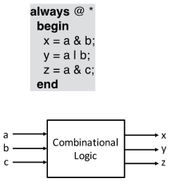

Verilog is concurrent in general - only code inside `always` blocks are procedural, where the ordering matters:

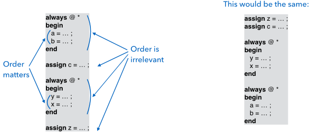

In an always block, all outputs must be assigned to in all situations to make the block combinational, and no output can be used as input to the block. If this is not true, the block becomes sequential and a latch is created in logic as it implies that an output retains its value or a loop is formed. Having a sequential `always` block can be fine, but can slow down modules if having the `always` block combinational would've meant the entire module was combinational.

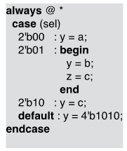 sequential->combinational 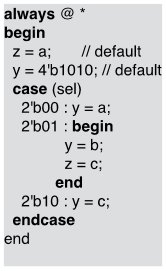

### **Case Statements**

Same as regular case statements, syntax seen here:

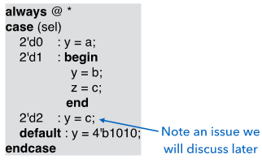 - The issue is no assignment to z, making this block sequential and not combinational (this can be ok, just not what was wanted in this case).

Case statements can be used to simulate decoders, multiplexers and other logic functions:

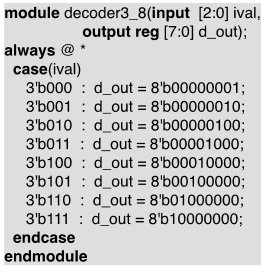

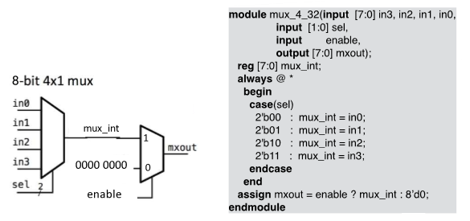

# Sequential Verilog

Example D-type latch using a sequential verilog `always` block:

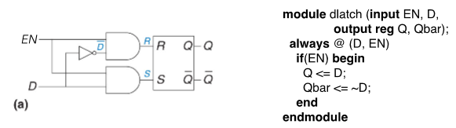

## Synchronous Verilog

Synchronous design in verilog allows for changes to be synchronised and allows the timing of the circuit to be more easily understood. Synchronising blocks can be done using a `clk` input to a module. By having `always` blocks triggered on the rising edge (`posedge`) of the `clk`, the outputs are of all blocks using `clk` updated at the same time - can be confusing if there are multiple `x_clk` signals for different blocks. `negedge` is the opposite of `posedge`, where the block triggers on the falling edge of the signal and by adding both `posedge` and `negedge`, the speed of execution can be doubled for the same clock signal (Double Data Rate (DDR)).\
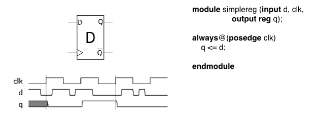 - The sensitivity list only contains the `clk` signal and only updates when `clk` changes from 0 to 1.

The `<=` (called non-blocking) symbol is used instead of `=` (called blocking) to synchronise the changes inside the block - they are all made at the same time, not sequentially. This means that the code below would swap the values in `var1` and `var2` when inside an `always` block, instead of setting both to `var2` as would occur using `=`.\
`var1 <= var2` \
`var2 <= var1`

### Registers

Registers are easy to set up in Verilog, example code is below. The `always` block represents 3 different registers - `q`, `r` and `s` - all of which share a `rst` signal and are clocked the same. The `clk` and `rst` signals in diagrams is not always drawn, and the `clk` signal can instead be assumed to be the same for all elements without one.\
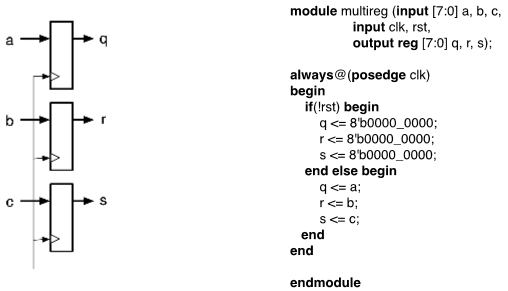

### Reset signals (for registers)

**Asynchronous:** whenever the reset signal is asserted, the contents of the register is reset.\
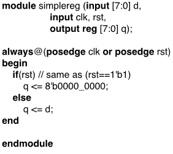

**Synchronous:** at a rising `clk` edge, if the reset signal is asserted then the register is reset (used in modern FPGAs).\
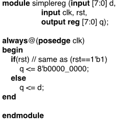

## Standard synchronous components in Verilog

### Complex counters

An example of a complex counter that can load in values and both increment/decrement.\
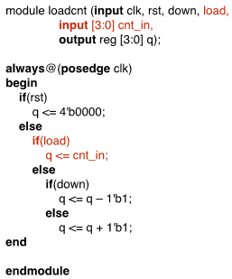

### Shift Registers

Example sequential read shift register, takes 4 clocks for the input to appear at the output: \
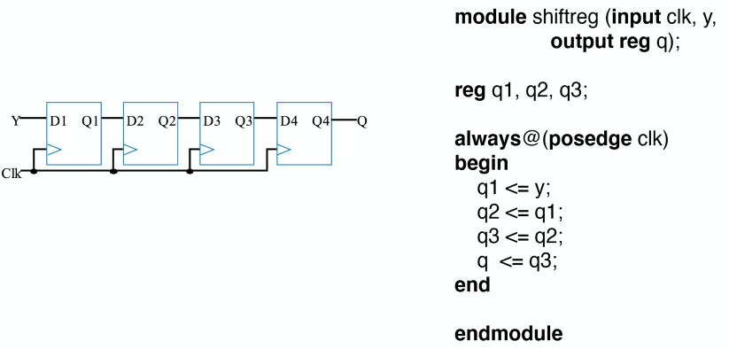 \
This could be changed to use a vector `q[2:0]` to store intermediate values more efficiently and allow the amount of intermediate latches to be extended easily. \
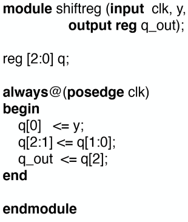 - can be extended by changing the definition of `q` to include more bits and changing indices in the `always` block.

As with counters, shift registers can be extended to be more complex. This register has an enable signal `sh` and reverses direction if `rt` is high. \
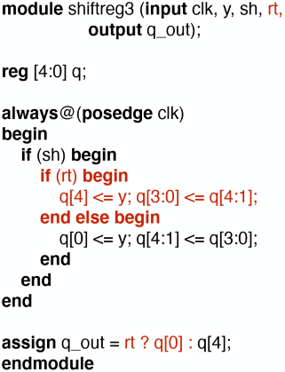

### Parallel to serial conversion

A new k-bit word is fed in to the converter every k cycles when `ld` is asserted. Each subsequent cycle 1 bit is outputted from the k-bit word. \
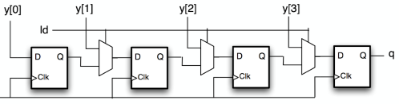 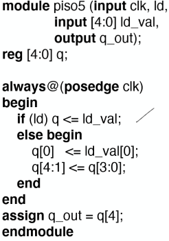

### FIFO Buffers

Multi-bit versions of shift registers, often used for creating delay lines. \
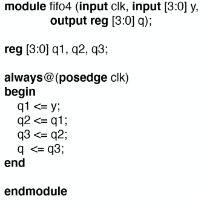

### Simple memory

Cells are created using `reg` in Verilog. `reg [X:0] ram [0:Y]` creates Y+1 cells that store X+1 bits that can be accessed using `ram[0<=N<=Y]` to access the X+1 bits stored at address N. \
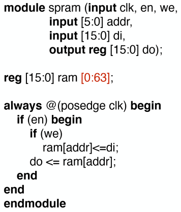

## What is synthesised from an always block?

All assignments made create registers on the FPGA. These are then linked together with combinational elements to create the required outputs. A synchronous `always` block can be broken into direct assignments to registers and combinational circuits. \
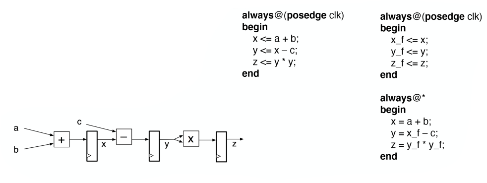

# Verilog Verification and Testing

Types of verification:

- **Algorithmic verification:** is the chosen algorithm suitable for the desired application implementation in FPGA - does the algorithm work in other software
- **Functional verification:** ensure the designed architecture correctly implements the algorithm - e.g. do shift registers work the same way in the FPGA as simulated?
- **Synthesis verification:** ensure the design is fully synthesisable and implementable on the desired target platform - is there enough LUTs on the FPGA to implement this?
- **Timing verification:** once synthesised, placed, etc, are the timing requirements met to reach the desired clock speeds?

Errors in design:

- specification is wrong/incomplete, so design meets specification but does not achieve what is required to function in use
- specification can be misinterpreted, so the design meets what you believe the specification means as opposed to what the specification actually means
- the specification is correctly understood, but the design has logic errors that mean it does not meet it

## Testbenches

A self-contained module typically without inputs/outputs. The module instantiates the unit under test (UUT) and contains a number of blocks that interact with that unit to ensure it functions correctly: clock generators, data/control signal generators and data/status signal monitors. \
 \
The drivers creates values that can be expected to be seen in real use to generate outputs that match what is expected. If the outputs of the unit under test are correct, we can assume that the unit under test functions as expected.

Testbench inputs and outputs to the unit under test are generated using `reg` for inputs and `wire` for outputs. \

Waiting can be achieved using `#X` to wait X timesteps (defined in the testbench settings) before executing the statement. These cannot be synthesised and can only be used in testbenches.

**`initial` block:** Can only be used in testbenches - cannot be synthesised. Similar layout to an `always` block, but is only run once at startup to give initial values to connections.

### Displaying data

The simulator has a console where text messages can be printed by the testbench. 